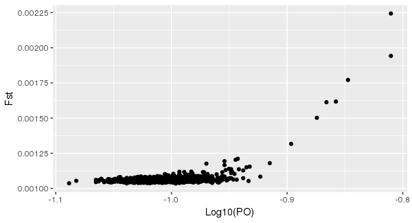
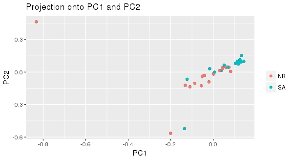
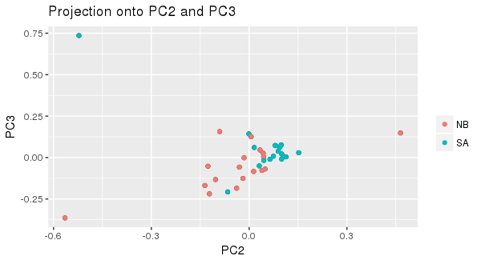
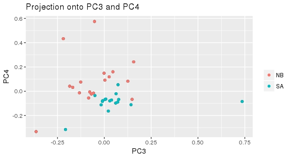

# BIO-594 FINAL PROJECT
# SNP Calling and neutral structure of two populations of the marine diatom <i>Thalassiosira rotula</i>

#### Ian Bishop
#### June 8, 2018


## PREPARATION OF WORKSPACE

These files are required for the following pipeline (and found in this subdirectory):

- popmap (a two column list of sampled individuals (as they are called in the VCF) and which population they belong to)
- BSsnp.spid
- plot_R.r 

As are these Puritz scripts, which are available via github:

```
curl -L -O https://github.com/jpuritz/dDocent/raw/master/scripts/filter_missing_ind.sh
chmod +x filter_missing_ind.sh

curl -L -O https://github.com/jpuritz/dDocent/raw/master/scripts/filter_hwe_by_pop.pl
chmod +x filter_hwe_by_pop.pl
```

Create and Activate a working environment and install the following conda packages:

```
#create environment
conda create -n final_project

# activate final_project environment
source activate final_project

# install packages
conda install fastqc multiqc bcftools

#install bamaddrg via github repository clone (https://github.com/ekg/bamaddrg)
#compile repository
#copy executable file to ~/bin

```


## RAW DATA ASSESSMENT AND TRIMMING

Combine fastq files to make one pair of R1 and R2 files per individual

```
# loop to combine multiple illumina output files into single fastq per isolate per end (R1, R2)

for name in ./*.fastq; do
	rsample=${name%_00*}
	rnum=${name##*_}
	cat "$name" >>"${rsample}.fastq"
done
```


Check initial read quality using FastQC and MultiQC

```
# run fastqc and multiqc on all fastq files for pre-trimming assessment
fastqc *.fastq

multiqc .


# export multiqc files
scp -P 2292 ibishop@kitt.uri.edu/~/final_project/raw_fastq/new_fastqc/*multiqc* .
```


Trim raw reads for adaptors and low quality using Trimmomatic
- End trimming quality threshold: 5
- Sliding window trimming quality threshold: 25

```
# make new directory for trimming
mkdir trim

# link to fastq files up one directory
ln -s ../*fastq

# loop through pairs of fastq files and trim them
for i in ./*R1.fastq.gz; do
	rsam=${i%R*}
	java -jar ./trimmomatic-0.36.jar PE -phred33 $i ${rsam}R2.fastq.gz ${i}_P_qtrim.fq.gz ${i}_UP_qtrim.fq.gz ${rsam}R2_P_qtrim.fq.gz ${rsam}R2_UP_qtrim.fq.gz ILLUMINACLIP:NexteraPE-PE.fa:2:30:10 LEADING:5 TRAILING:3 SLIDINGWINDOW:4:25 MINLEN:50
done
```


Rerun FastQC and MultiQC post-trimming to assess improvement

```
# run fastqc and multiqc on all fastq files for trimming assessment
fastqc *.fastq
multiqc .


# export multiqc files
scp -P 2292 ibishop@kitt.uri.edu/~/final_project/raw_fastq/new_fastqc/*multiqc* .
```


Pre and Post-Trimming Examples of bp quality, via MultiQC

Raw

Trimmed


## MAP FILTERED READS

I did not assemble myself, as the process of binning and removing large chunks of the dataset was a bit much for me to take on, and the
top was not one we discussed in class. Instead, a former lab member had already done some heavy lifting to assemble these data with Megahit, 
and to Blast the resulting contigs to remove those likely not belonging to <i>T. rotula</i>.
```
#index ref
bwa index ref_euk.fa


# loop through R1 files, run bwa mem for all pairs, save as bam, sort bam
# consider looping through unpaired R1/R2 fq files as well
for i in `ls *R1_paired.fq | tail`; do
	rsam=${i%R*}
	#align with bwa mem, convert to uncompressed BAM, removing unpaired and unmapped reads, then sorted and saved
	#add '-f 0x02' if you want to exclude unpaired reads
	bwa mem ref_euk.fa $i ${rsam}R2_paired.fq -t 20 | samtools view -F 0x04 -@ 20 -Su - | samtools sort - > ${i}.bam
done


# loop to rename bams
for i in `ls *.bam`; do
	libr=${i%%_*}
	mv $i ${libr}.bam	
done
	
	
# loop to mark and delete duplicates with Picard
for i in `ls *.bam`; do
	#marking and deleting duplicates
	java -jar picard.jar MarkDuplicates \
	INPUT=${i} \
	OUTPUT=dedup_${i} \
	REMOVE_DUPLICATES=true \
	METRICS_FILE=metrics.txt
done


# make list of sorted bams
ls dedup_*.bam > sorted_dedup_bams


# add read group ids
for i in `cat sorted_dedup_bams`; do
	#libr=${i%%.dedup.bam};
	tmp=${i#*_};
	libr=${tmp%*.bam};
	bamaddrg -b $i > ${libr}.sorted.dedup.rg.bam;
	rm $i
done


#merge bam files
samtools merge merged.bam *rg.bam

#index merged.bam
samtools index merged.bam


# make list of sorted, deduped, rg-tagged bams; not using currently
ls *sorted.dedup.rg.bam > sorted_dedup_rg_bams
```


## CALL SNPS, FILTER SNPs

```
# create one more index for samtools for ref.euk.fa
samtools faidx ref_euk.fa


# call snps/indels from list of bam files. grand list of bams doesn't seem to work
#freebayes -f ref_euk.fa -L sorted_dedup_rg_bams > total_snps.vcf

#call snps/indels from merged bam, instead of list of bams
freebayes -f ref_euk.fa merged.bam > total_snps.vcf

# can't get parallel version of freebayes. fix for future use
# freebayes-parallel <(~/freebayes/scripts/fasta_generate_regions.py ref.fa.fai 100000) 36 -f ref_euk.fa -L sorted_dedup_rg_bams > var.vcf

#remove INDELS
vcftools --vcf total_snps.vcf --remove-indels --recode --recode-INFO-all --out total_snps

#filter out genotypes found in fewer than 50% of individuals, minor allele count of 3, and lower quality scores
vcftools --vcf total_snps.recode.vcf --max-missing 0.5 --mac 0.03 --minQ 20 --recode --recode-INFO-all --out raw.g5mac3

#doesn't do much, this one
#filter out loci with less than depth of 3
vcftools --vcf raw.g5mac3.recode.vcf --minDP 3 --recode --recode-INFO-all --out raw.g5mac3dp3 

#filter out individuals with lots of missing data
../filter_missing_ind.sh raw.g5mac3dp3.recode.vcf raw.g5mac3dplm

#filter out loci with lots of missing data
vcftools --vcf raw.g5mac3dplm.recode.vcf --max-missing 0.95 --maf 0.05 --recode --recode-INFO-all --out DP3g95maf05 --min-meanDP 20

#filter out loci where alleles frequency is very far from 0.5
vcffilter -s -f "AB > 0.20 & AB < 0.80 | AB < 0.01" DP3g95maf05.recode.vcf > DP3g95maf05.fil1.vcf

#check current SNP count
mawk '!/#/' DP3g95maf05.fil1.vcf | wc -l

#drop loci where quality is much greater than depth
vcffilter -f "QUAL / DP > 0.25" DP3g95maf05.fil1.vcf > DP3g95maf05.fil5.vcf

#check current SNP count
mawk '!/#/' DP3g95maf05.fil5.vcf | wc -l

#filter by HWE
vcfallelicprimitives DP3g95maf05.fil5.vcf --keep-info --keep-geno > DP3g95maf05.prim.vcf
vcftools --vcf DP3g95maf05.prim.vcf --remove-indels --recode --recode-INFO-all --out SNP.DP3g95maf05
#make sure the popmap has only the remaining individuals and their correct names here
./filter_hwe_by_pop.pl -v SNP.DP3g95maf05.recode.vcf -p popmap_wo_head -o SNP.DP3g95maf05.HWE -h 0.001

#how many SNPs in final dataset?
mawk '!/#/' SNP.DP3g95maf05.HWE.recode.vcf | wc -l

#rename final vcf file
mv SNP.DP3g95maf05.HWE.recode.vcf SNP.DP3g95maf05.HWE.FINAL.vcf 
```

## ANALYSIS

Bayescan to visualize putative outliers

Some required files to place in your working directory

- popmap
- BSsnp.spid
- plot_R.r

```
#run PGDSpider
java -jar /usr/local/bin/PGDSpider2-cli.jar -inputfile SNP.DP3g95maf05.HWE.FINAL.vcf -outputfile SNP.DP3g95maf05.HWE.FINAL_BS -spid ../BSsnp.spid

#run BayeScan
BayeScan2.1_linux64bits SNP.DP3g95maf05.HWE.FINAL_BS -nbp 30 -thin 20

#start R
R

#load libraries
library(ggplot2)
library(gridExtra)

#input data, organize/rename a bit
outliers <- read.csv("SNP.DP3g95maf05.HWE.FINA_fst.txt", header=TRUE, sep=" ")
outliers <- outliers[,3:7]
names(outliers) <- c("prob", "log10_PO", "qval", "alpha", "fst")

#plot Bayescan results, Fst~Log10(PO)
p1 <- ggplot(outliers, aes(log10_PO, fst)) + 
        geom_point() +
       # theme_bw() +
        xlab("Log10(PO)") +
        ylab("Fst")

p1
```

```
#export to jpeg; having problems with XQuartz; the following should work locally
jpeg("Fst_Log10PO.jpeg")
p1
dev.off()
```


PCAdapt to visualize clustering by sampling locality
```
#setwd

#Load pcadapt library
library(pcadapt)
library(gridExtra)

#load our VCF file into R
filename <- read.pcadapt("DP3g95maf05.FINAL.recode.vcf", type = "vcf" )

#Create first PCA
x <- pcadapt(input = filename, K = 20)

#Plot the likelihoods
plot(x, option = "screeplot")

#Create population designations
poplist.names <- c("NB","NB","NB","SA","NB","SA","SA","SA","NB","SA","SA","NB","NB","SA","NB","NB","NB","SA","SA","SA","NB","NB","SA","SA","NB","NB","SA","SA","NB","NB","SA","SA","NB","NB","SA")

#Plot the actual PCA (first two PCAs)
plot(x, option = "scores", pop = poplist.names)
```

```
#Plot PCA with PCA 2 and PCA 3
plot(x, option = "scores", i = 2, j = 3, pop = poplist.names)
```

```
#Plot PCA with PCA 3 and PCA 4
plot(x, option = "scores", i = 3, j = 4, pop = poplist.names)
```

```
#this would normally work, but I think the ssh/XQuartz thing is acting up
jpeg("pcadapt_1X2.jpeg")
plot(x, option = "scores", pop = poplist.names)
dev.off()
jpeg("pcadapt_2X3.jpeg")
plot(x, option = "scores", i = 2, j = 3, pop = poplist.names)
dev.off()
jpeg("pcadapt_3X4.jpeg")
plot(x, option = "scores", i = 3, j = 4, pop = poplist.names)
dev.off()
```
