# BIO-594 FINAL PROJECT
# SNP Calling and neutral structure of two populations of the marine diatom <i>Thalassiosira rotula</i>

#### Ian Bishop
#### June 8, 2018


## PREPARATION OF WORKSPACE

Create working directory, soft link raw data in
```
#new directory
mkdir latest_run/

#make symbolic links to raw data
ln -s ../data/raw_fastq/*fastq.gz .

```
These files are required for the following pipeline (and found in this subdirectory):

- popmap_total: a tab-delimited txt file with two columns, one of libraries (e.g. lib21.bam, as they are called in vcf) and one of population (e.g "SA" or "NA")
- BSsnp.spid
- plot_R.r
- merge_by_indiv.sh

As are these Puritz scripts, which are available via github:

```
curl -L -O https://github.com/jpuritz/dDocent/raw/master/scripts/filter_missing_ind.sh
chmod +x filter_missing_ind.sh

curl -L -O https://github.com/jpuritz/dDocent/raw/master/scripts/filter_hwe_by_pop.pl
chmod +x filter_hwe_by_pop.pl

#add Trimmomatic file, which includes .jar file and adapters
curl -L -O http://www.usadellab.org/cms/uploads/supplementary/Trimmomatic/Trimmomatic-0.38.zip
unzip Trimmomatic-0.38.zip
rm Trimmomatic-0.38.zip
```

Create and activate a working environment, then install the following conda packages:

```
#create environment
conda create -n final_project

# activate final_project environment
source activate final_project

# install packages
conda install fastqc multiqc bcftools

#install bamaddrg via github repository clone (https://github.com/ekg/bamaddrg)
#compile repository
#copy executable file to ~/bin
```


## RAW DATA ASSESSMENT AND TRIMMING

Combine fastq files to make one pair of R1 and R2 files per individual

```
# loop to combine multiple illumina output files into single fastq per isolate per end (R1, R2)

for name in ./*.fastq.gz; do
	rsample=${name%_00*}
	rnum=${name##*_}
	cat "$name" >>"${rsample}.fastq.gz"
done

# remove symbolic links
rm *_R[123]_00[123].fastq.gz
```


Check initial read quality using FastQC and MultiQC

```
# run fastqc and multiqc on all fastq files for pre-trimming assessment
fastqc *.fastq.gz

# run multiqc on fastqc files
multiqc .

# move fastqc and multiqc files into qc_untrimmed folder
mkdir qc_untrimmed
mv *fastqc* qc_untrimmed
mv multiqc* qc_untrimmed

# export multiqc report, use another terminal window not logged into KITT
scp -P 2292 ibishop@kitt.uri.edu:~/final_project/latest_run/qc_untrimmed/multiqc_report.html .

#open html file on local computer, save "Sequence Quality Histogram" as "multiqc_untrimmed_seq_qual_hist.png"
```


Trim raw reads for adaptors and low quality using Trimmomatic
- End trimming quality threshold: 5
- Sliding window trimming quality threshold: 25

```
# make new directory for trimming
mkdir trimmed

#move to new trimmed file folder
cd trimmed

# copy trimmomatic jar file and Nextera adapter file into trimmed/
# had weird issues with relative addresses for these files in below for loop	

#link to fastq files up one directory
ln -s ../*fastq.gz .

# loop through pairs of fastq files and trim them
for i in *R1.fastq.gz; do
	rsam=${i%R*}
	java -jar trimmomatic-0.38.jar PE -phred33 $i ${rsam}R2.fastq.gz ${i}_P_qtrim.fq.gz ${i}_UP_qtrim.fq.gz ${rsam}R2_P_qtrim.fq.gz ${rsam}R2_UP_qtrim.fq.gz ILLUMINACLIP:NexteraPE-PE.fa:2:30:10 LEADING:5 TRAILING:3 SLIDINGWINDOW:4:25 MINLEN:50
done

#rename trimmed output
for i in *R1*_P_*; do mv "$i" "$(echo $i | sed 's/.fastq.gz_P_qtrim/_paired/g')"; done
for i in *R2_P_*; do mv "$i" "$(echo $i | sed 's/_P_qtrim/_paired/g')"; done
for i in *R1*_UP_*; do mv "$i" "$(echo $i | sed 's/.fastq.gz_UP_qtrim/_unpaired/g')"; done
for i in *R2_UP_*; do mv "$i" "$(echo $i | sed 's/_UP_qtrim/_unpaired/g')"; done

#remove symbolic links to parent directory
```


Rerun FastQC and MultiQC post-trimming to assess improvement

```
# run fastqc and multiqc on all fastq files for trimming assessment
fastqc *.fq.gz
multiqc .

#rename multiqc output report
mv multiqc_report.html multiqc_report_trimmed.html


# export multiqc files
scp -P 2292 ibishop@kitt.uri.edu:~/final_project/latest_run/trimmed/multiqc_report.html .

#open html file on local computer, save "Sequence Quality Histogram" as "multiqc_trimmed_seq_qual_hist.png"

#remove zip files from trimmed folder
rm *.zip

#move fastqc html files to fastqc folder
mkdir fastqc_trimmed
mv *fastqc.html fastqc_trimmed

#move to project home folder, make untrimmed folder, add untrimmed fastq.gz files, add qc_untrimmed directory
cd /home/ibishop/final_project/latest_run
mkdir untrimmed
mv *fastq.gz untrimmed/
mv qc_untrimmed/ untrimmed/
```


Pre and Post-Trimming Examples of bp quality, via MultiQC

Raw (untrimmed)
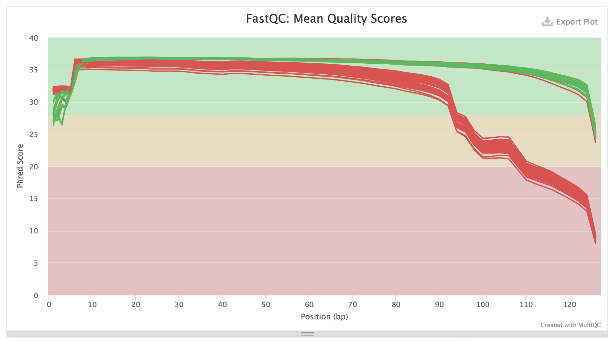

Trimmed
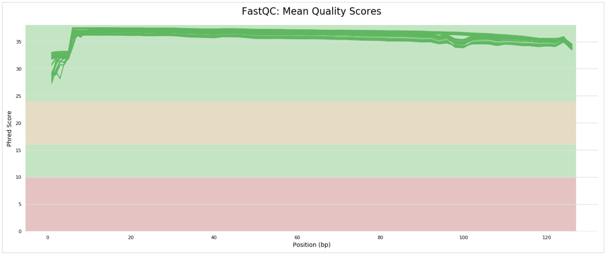


## MAP TRIMMED READS

I did not assemble myself, as the process of binning and removing large chunks of the dataset was a bit much for me to take on, and the
top was not one we discussed in class. Instead, a former lab member had already done some heavy lifting to assemble these data with Megahit, 
and to Blast the resulting contigs to remove those likely not belonging to <i>T. rotula</i>.
```
#make directory for mapping
mkdir mapping_reads

#make symbolic links of trimmed read fq.gz files
ln -s ../trimmed/*_paired.fq.gz .

#add ref_euk.fa to directory
cp ../../previous_run/ref_euk.fa .


#index ref
bwa index ref_euk.fa


# loop through R1 files, run bwa mem for all pairs, save as bam, sort bam
# consider looping through unpaired R1/R2 fq files as well
for i in `ls *R1_paired.fq`; do
	rsam=${i%R*}
	libr=${i%%_*}
	#align with bwa mem, convert to uncompressed BAM, removing unpaired and unmapped reads, then sorted and saved
	#add '-f 0x02' if you want to exclude unpaired reads
	#add '-F 0x04' if you want to exclude unmapped reads
	bwa mem ref_euk.fa $i ${rsam}R2_paired.fq -t 20 | samtools view -@ 20 -Su - | samtools sort - > ${libr}.sorted.allreads.bam
	
	#extract numbers only from flagstat command
	mapped=`samtools flagstat ${libr}.sorted.allreads.bam | grep 'mapped (' | sed 's/\s.*//'`
	total=`samtools flagstat ${libr}.sorted.allreads.bam | grep 'total' | sed 's/\s.*//'`
	unmapped=`expr $total - $mapped`
	proportion_mapped=`bc<<<"scale=2; $mapped / $total"`

	#combine all three into one tab-delimited line with library name
	echo "$libr"$'\t'"$mapped"$'\t'"$unmapped"$'\t'"$total"$'\t'"$proportion_mapped" >> tmp.txt
done

#add header to newly created mapping_output.txt file
echo $'library\tmapped\tunmapped\ttotal\tproportion_mapped' | cat - tmp.txt  > mapping_output.txt
rm tmp.txt
```


## Plot Mapped Proportion by Library
```
#load R
R

library(ggplot2)
library(reshape2)
library(RColorBrewer)
library(gridExtra)

#import mapping data
df <- read.table("test_mapped_prop_graph.txt", header=TRUE, stringsAsFactors = TRUE)
#add unmapped_proportion variable
df$unmapped_prop <- 1-df$proportion_mapped
#remove non-proportion variables
df2 <- df[,c(1,5,6)]
#df8 and 9 route are same as df2/3/4 route but for absolate abundance, not relative proportion
df8 <- df[,1:3]
#rename variables
names(df2) <- c("library", "mapped", "unmapped")
#convert mapping proportion variables to long format from wide format
df3 <- melt(df2, id.vars="library")
df8 <- melt(df8, id.vars="library")
#reorder library factor levels, so graph x axis is ordered by mapped proportion
df3$library <- reorder(df3$library, df3$value, FUN=max)
df8$library <- reorder(df8$library, df8$value, FUN=max)

#import popmap (which libraries are assigned to each population)
popmap <- read.table("test_popmap_all.txt", header=TRUE, stringsAsFactors = TRUE)
#drop ".bam" part of popmap library strings
popmap$library <- as.character(popmap$library)
popmap$library = substr(popmap$library,1,nchar(popmap$library)-4)
#merge popmap with df3 to add population variable to dataset
df4 <- merge(df3, popmap)
df9 <- merge(df8, popmap)

#NB rel prop read graph
p1 <- ggplot(subset(df4, population == "NB"), aes(x=library, y=value, fill=variable)) + 
        geom_bar(stat="identity") + 
        scale_fill_manual(values=c("#D55E00", "#0072B2")) + 
        ggtitle("Narragansett Bay Isolates") +
        ylab("Proportion") +
        xlab("Library") +
        guides(fill=guide_legend(title=NULL))
        # theme(legend.position="bottom", 
        #       legend.title = element_blank(), 
        #       legend.text=element_text(size=8),
        #       legend.key.size = unit(5, "mm"))

#SA rel prop read graph
p2 <- ggplot(subset(df4, population == "SA"), aes(x=library, y=value, fill=variable)) + 
        geom_bar(stat="identity") + 
        scale_fill_manual(values=c("#D55E00", "#0072B2")) + 
        ylab("Proportion") +
        xlab("Library") +
        ggtitle("South African Isolates") +
        guides(fill=guide_legend(title=NULL))

#combine into single graphic; save as png, then photoshop/gimp to move one of legends into middle space and delete area right of graphs
grid.arrange(p1, p2)
```


```
#convert values to million unit
df9$value <- df9$value/1000000

#NB absolate read count graph
p3 <- ggplot(subset(df9, population == "NB"), aes(x=library, y=value, fill=variable)) + 
  geom_bar(stat="identity") + 
  scale_fill_manual(values=c("#D55E00", "#0072B2")) + 
  ggtitle("Narragansett Bay Isolates") +
  ylab("Read abundance (millions)") +
  ylim(c(0,8)) +
  xlab("Library") +
  guides(fill=guide_legend(title=NULL))
# theme(legend.position="bottom", 
#       legend.title = element_blank(), 
#       legend.text=element_text(size=8),
#       legend.key.size = unit(5, "mm"))

#SA absolute read count graph
p4 <- ggplot(subset(df9, population == "SA"), aes(x=library, y=value, fill=variable)) + 
  geom_bar(stat="identity") + 
  scale_fill_manual(values=c("#D55E00", "#0072B2")) + 
  ylab("Read abundance (millions)") +
  ylim(c(0,8)) +
  xlab("Library") +
  ggtitle("South African Isolates") +
  guides(fill=guide_legend(title=NULL))

#combine into single graphic; save as png, then photoshop/gimp to move one of legends into middle space and delete area right of graphs
grid.arrange(p3, p4)
```

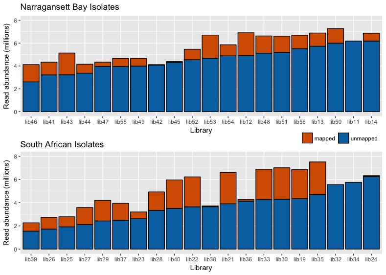


## Remove unmapped reads, mark and delete duplicates
```
#remove unmapped reads
for i in `ls *sorted.allreads.bam`; do
	libr=${i%%.*}
	samtools view -b -F 4 $i > ${libr}.sorted.bam
	rm $i
done	


	
# loop to mark and delete duplicates with Picard; aggregate part of metrics file from each library into new file duplicate_readout.txt
for i in `ls *.sorted.bam`; do
	libr=${i%%.sorted.bam}
	#marking and deleting duplicates
	java -jar picard.jar MarkDuplicates \
	INPUT=${i} \
	OUTPUT=${libr}.sorted.dedup.bam \
	REMOVE_DUPLICATES=true \
	METRICS_FILE=metrics.txt
	cat -n metrics.txt | grep 'Unknown' >> tmp.txt
	rm $i
done

#make a popmap_total_w_head
echo $'library\tpopulation' | cat - popmap_total  > popmap_total_w_head

#concatenate metrics.txt file header with duplicate info, then delete tmp files
cat -n metrics.txt | grep 'LIBRARY' | cat - tmp.txt  > tmp2.txt
sed -e "s/[[:space:]]\+/\t/g" tmp2.txt > tmp3.txt
#add library column to duplicates_output.txt, rename
paste -d' ' popmap_w_head tmp3.txt > duplicate_output.txt
rm tmp.txt tmp2.txt tmp3.txt metrics.txt
```

## Plot percent of mapped reads duplicate
```
#Launch R
R

#import duplicate_output.txt
dups <- read.table("test_output2.txt")
#add lib column from rownames
dups$library <- rownames(dups)

#import popmap_total_w_head (which libraries are assigned to each population)
popmap <- read.table("test_popmap_all.txt", header=TRUE, stringsAsFactors = TRUE)
#cbind popmap with dups to add population variable to dataset; data MUST BE IN ORDER TO DO THIS STEP
dups$population <- popmap$population
#reorder libraries by percent duplication
dups$library <- reorder(dups$library, dups$PERCENT_DUPLICATION, FUN=max)

#import popmap (which libraries are assigned to each population)
popmap <- read.table("test_popmap_all.txt", header=TRUE, stringsAsFactors = TRUE)
#merge popmap with df3 to add population variable to dataset
dups$population <- popmap$population

dups$library <- as.character(dups$library)
dups$library = substr(dups$library,1,nchar(dups$library)-4)
dups$library <- reorder(dups$library, dups$PERCENT_DUPLICATION, FUN=max)

#multiple by 100 to make proportion percent
dups$PERCENT_DUPLICATION <- dups$PERCENT_DUPLICATION*100

#assign plot duplication percention by library 
p5 <- ggplot(dups, aes(x=PERCENT_DUPLICATION, y=library, colour=population)) + 
  		geom_point(stat="identity") + 
  		scale_colour_manual(values=c("#D55E00", "#0072B2")) +
 		  xlab("Duplication (%)") + 
 		  ylab("Library") +
 		  guides(fill=guide_legend(title=NULL)) + 
		  theme(legend.key=element_blank(), 
  	        legend.position = "bottom", 
       	    legend.background = element_rect(fill = NA),
            legend.direction = "horizontal")

#call plot
p5
```

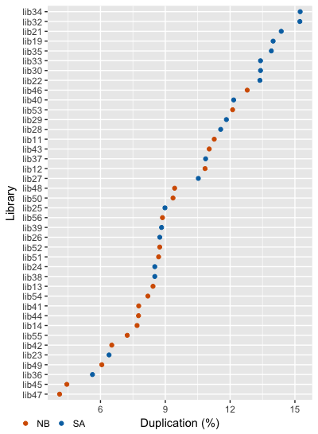

```
#exit R; save current environment
exit()
```

## Add read group IDs, make list of final bam files
```
# add read group ids
for i in `ls *.sorted.dedup.bam`; do
	libr=${i%%.sorted.dedup.bam};
	bamaddrg -b $i > ${libr}.sorted.dedup.rg.bam;
	rm $i
done

# make list of sorted, deduped, rg-tagged bams
ls *sorted.dedup.rg.bam > sorted_dedup_rg_bams

#merge bam files; not using currently
samtools merge merged.bam *sorted.dedup.rg.bam

#index merged.bam; not using currently
samtools index merged.bam
```


## CALL SNPS, FILTER SNPs

```
# create one more index for samtools for ref.euk.fa
samtools faidx ref_euk.fa

# call snps/indels from list of bam files. grand list of bams doesn't seem to work
freebayes -f ref_euk.fa -L sorted_dedup_rg_bams > total_snps.vcf

# call snps/indels from merged bam, instead of list of bams
#freebayes -f ref_euk.fa merged.bam > total_snps.vcf

# can't get parallel version of freebayes. fix for future use
# freebayes-parallel <(~/freebayes/scripts/fasta_generate_regions.py ref.fa.fai 100000) 36 -f ref_euk.fa -L sorted_dedup_rg_bams > var.vcf

# remove INDELS
vcftools --vcf total_snps.vcf --remove-indels --recode --recode-INFO-all --out total_snps

# filter out genotypes found in fewer than 50% of individuals, minor allele count of 3, and lower quality scores
vcftools --vcf total_snps.recode.vcf --max-missing 0.5 --mac 3 --minQ 20 --recode --recode-INFO-all --out raw.g5mac3

# filter out loci with less than depth of 3
vcftools --vcf raw.g5mac3.recode.vcf --minDP 3 --recode --recode-INFO-all --out raw.g5mac3dp3 

# filter out individuals with lots of missing data
../filter_missing_ind.sh raw.g5mac3dp3.recode.vcf raw.g5mac3dplm


                                        Histogram of % missing data per individual

    4 ++----------+--***------+------------+-----------+-----------+-----------+------------+-----------+----------++
      +           +  * *      +            +           +       'totalmissing' using (bin($1,binwidth)):(1.0) ****** +
      |              * *                                                                                            |
      |              * *                                                                                            |
  3.5 ++             * *                                                                                           ++
      |              * *                                                                                            |
      |              * *                                                                                            |
      |              * *                                                                                            |
    3 ++             * *                      ****                                                                 ++
      |              * *                      *  *                                                                  |
      |              * *                      *  *                                                                  |
  2.5 ++             * *                      *  *                                                                 ++
      |              * *                      *  *                                                                  |
      |              * *                      *  *                                                                  |
      |              * *                      *  *                                                                  |
    2 ++             * * *******   *****      *  *  ***        ***                                                 ++
      |              * * *  *  *   * * *      *  *  * *        * *                                                  |
      |              * * *  *  *   * * *      *  *  * *        * *                                                  |
      |              * * *  *  *   * * *      *  *  * *        * *                                                  |
  1.5 ++             * * *  *  *   * * *      *  *  * *        * *                                                 ++
      |              * * *  *  *   * * *      *  *  * *        * *                                                  |
      |              * * *  *  *   * * *      *  *  * *        * *                                                  |
      +           +  * * *  * +*   * * *   +  *  *  * *+       * * +           +            +           +           +
    1 ++----------+--***-*******---*****---+--****--***+-------***-+-----------+------------+-----------+----------++
     0.1         0.2         0.3          0.4         0.5         0.6         0.7          0.8         0.9          1
                                                     % of missing data
The 85% cutoff would be 0.736702

Would you like to set a different cutoff, yes or no

yes

Please enter new cutoff

0.5


 
# filter out loci with lots of missing data
vcftools --vcf raw.g5mac3dplm.recode.vcf --max-missing 0.95 --maf 0.05 --recode --recode-INFO-all --out DP3g95maf05 --min-meanDP 20

# filter out loci where alleles frequency is very far from 0.5
vcffilter -s -f "AB > 0.20 & AB < 0.80 | AB < 0.01" DP3g95maf05.recode.vcf > DP3g95maf05.fil1.vcf

# check current SNP count
mawk '!/#/' DP3g95maf05.fil1.vcf | wc -l

# drop loci where quality is much greater than depth
vcffilter -f "QUAL / DP > 0.25" DP3g95maf05.fil1.vcf > DP3g95maf05.fil5.vcf

# check current SNP count
mawk '!/#/' DP3g95maf05.fil5.vcf | wc -l

# filter by HWE
vcfallelicprimitives DP3g95maf05.fil5.vcf --keep-info --keep-geno > DP3g95maf05.prim.vcf
vcftools --vcf DP3g95maf05.prim.vcf --remove-indels --recode --recode-INFO-all --out SNP.DP3g95maf05
#make sure the popmap has only the remaining individuals and their correct names here
./filter_hwe_by_pop.pl -v SNP.DP3g95maf05.recode.vcf -p popmap_wo_head -o SNP.DP3g95maf05.HWE -h 0.001

# how many SNPs in final dataset?
mawk '!/#/' SNP.DP3g95maf05.HWE.recode.vcf | wc -l

# rename final vcf file
mv SNP.DP3g95maf05.HWE.recode.vcf SNP.DP3g95maf05.HWE.FINAL.vcf 

#make popmap and popmap_wo_head files; be sure to have popmap_total file in directory
grep '#CHROM' DP3g95maf05.fil5.vcf  | tr '\t' '\n' | sed '1,9 d' | sed 's/^dedup_//' > retained_libs
join -1 1 -2 1 -a1 -e0 retained_libs popmap_total > popmap_wo_head
echo -e 'Individual\tPopulation' | cat - popmap_wo_head > popmap
```

## Table 1. Number of SNPS and Isolates/Individuals after each filtering step

| Step | Remaining Loci | Remaining Isolates |
| :---------------- |:---------:| :------: |
| Raw SNPs/INDELS | 712783 | 40 |
| SNPs only | 420669 | 40 |
| SNPs genotyped in > 50% of Isolates, minor allele count > 3, QUAL > 20 | 206671 | 40 |
| SNPs with Depth > 3  | 206671 | 40 |
| Individuals with < 50% missing data  | 206671 | 28 |
| SNPs genotyped in > 95% Isolates, MAF > 0.05 , Mean Depth > 20  | 50265 | 28 |
| SNPs where allelic balace is 0.2-0.8  | 17857 | 28 |
| SNP Quality:Read Depth > 0.25  | 17184 | 28 |
| SNPs in HWE (p-value = 0.001) | 5110 | 28 |


## ANALYSIS

Bayescan to visualize putative outliers

```
# run PGDSpider
java -jar /usr/local/bin/PGDSpider2-cli.jar -inputfile SNP.DP3g95maf05.HWE.FINAL.vcf -outputfile SNP.DP3g95maf05.HWE.FINAL_BS -spid BSsnp.spid

# run BayeScan
BayeScan2.1_linux64bits SNP.DP3g95maf05.HWE.FINAL_BS -nbp 30 -thin 20 - threads 20

# start R
R

# load libraries
library(ggplot2)
library(gridExtra)

# input data, organize/rename a bit
outliers <- read.csv("SNP.DP3g95maf05.HWE.FINA_fst.txt", header=TRUE, sep=" ")
outliers <- outliers[,3:7]
names(outliers) <- c("prob", "log10_PO", "qval", "alpha", "fst")

# plot Bayescan results, Fst~Log10(PO)
p1 <- ggplot(outliers, aes(log10_PO, fst)) + 
        geom_point() +
        scale_x_continuous(limits=c(-2,3)) +
        #theme_bw() +
        xlab("Log10(PO)") +
        ylab("Fst")

p1
```
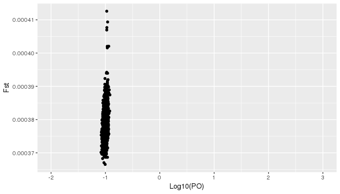
```
# export to jpeg; having problems with XQuartz; the following should work locally
jpeg("Fst_Log10PO.jpeg")
p1
dev.off()

#quit R
quit()
```


PCAdapt to visualize clustering by sampling locality
```
#filter out loci with more than 2 alleles
vcftools --vcf SNP.DP3g95maf05.HWE.recode.vcf --max-alleles 2 --recode --recode-INFO-all --out SNP.DP3g95maf05.HWE.2a

#start R

#setwd; choose your own directory

#Load libraries
library(pcadapt)
library(gridExtra)

#load our VCF file into R
filename <- read.pcadapt("SNP.DP3g95maf05.HWE.FINAL.vcf", type = "vcf" )

#Create first PCA
x <- pcadapt(input = filename, K = 20)

#Plot the likelihoods
plot(x, option = "screeplot")
```
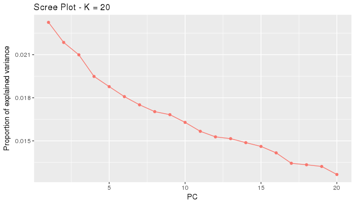
```
#Create population designations
#grab from poplist file using: awk -F '\t' '{print $2}' poplist
poplist.names <- c("NB","NB","NB","SA","SA","SA","SA","SA","SA","SA","SA","SA","SA","SA","SA","SA","SA","SA","NB","NB","NB","NB","NB","NB","NB","NB","NB","NB")

#Plot the actual PCA (first two PCAs)
p1 <- plot(x, option = "scores", i=1, j=2, pop=poplist.names)
```
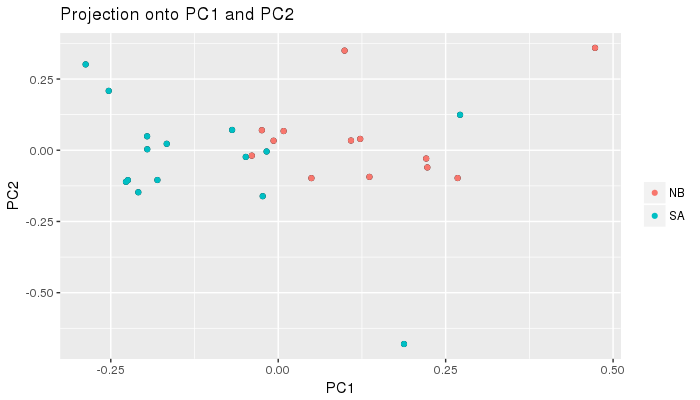
```
#Plot PCA with PCA 1 and PCA 3
p2 <- plot(x, option = "scores", i=1, j=3, pop = poplist.names)
```
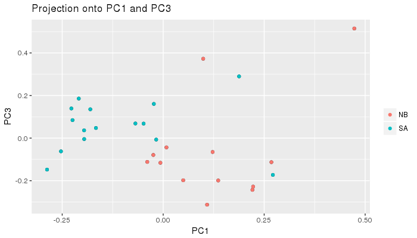
```
#Plot PCA with PCA 2 and PCA 3
p3 <- plot(x, option = "scores", i=2, j=3, pop = poplist.names)
```
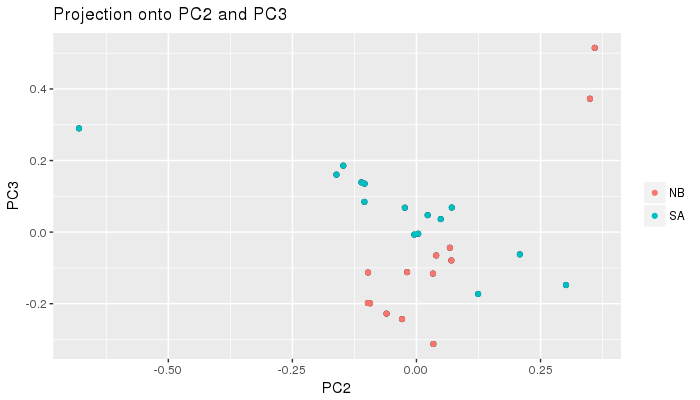
```
#Plot PCA with PCA 2 and PCA 4
p4 <- plot(x, option = "scores", i=2, j=4, pop = poplist.names)
```
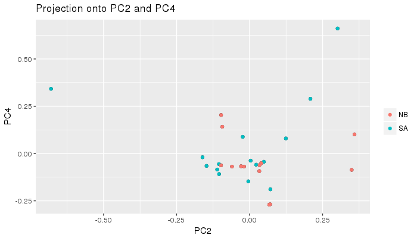
```

#Start looking for outliers
#Make Manhattan Plot
plot(x , option = "manhattan")
```
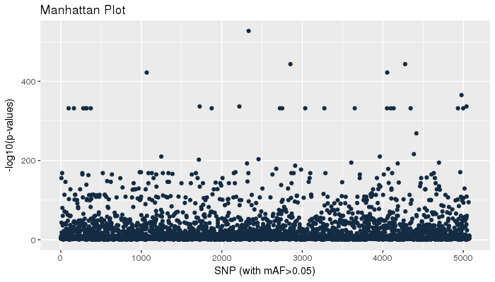
```
#Make qqplot
plot(x, option = "qqplot", threshold = 0.1)
```
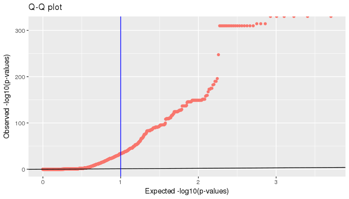
```
# Look at P-value distribution
plot(x, option = "stat.distribution")
```
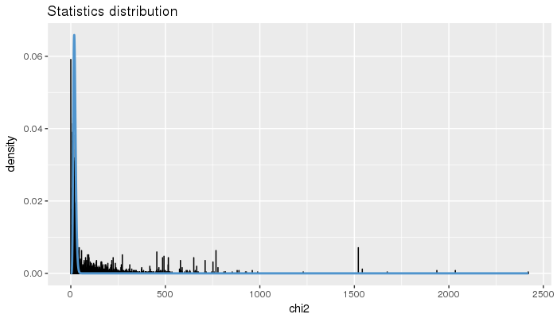
```

# Set FDR
library(qvalue)
qval <- qvalue(x$pvalues)$qvalues
alpha <- 0.05

# Save outliers
outliers <- which(qval < alpha)
write.csv(outliers, "outliers.txt", row.names = FALSE)


#quit R, save session
quit()
```

Remove outliers and plot again

```
###remove outlier loci from vcf
#split final vcf into header and body lines
grep '^#' -v SNP.DP3g95maf05.HWE.FINAL.vcf > final_body.vcf
grep '^#' SNP.DP3g95maf05.HWE.FINAL.vcf > final_head.vcf

# remove header from outlier file
sed -i '1d' outliers.txt

#remove outlier lines from vcf body, save as neutralvcf body
sed "$(sed 's/$/d/' outliers.txt)" final_body.vcf > neutralSNPs_body.vcf

#add vcf header lines back, save as outlier_filtered, neutral vcf file
cat final_head.vcf neutralSNPs_body.vcf > neutralSNPs.vcf


#start R again
R

#try again with neutral filtered set
filename <- read.pcadapt("neutralSNPs.vcf", type = "vcf" )

#Create first PCA
y <- pcadapt(input = filename, K = 20)

#Plot the likelihoods
plot(y, option = "screeplot")
```
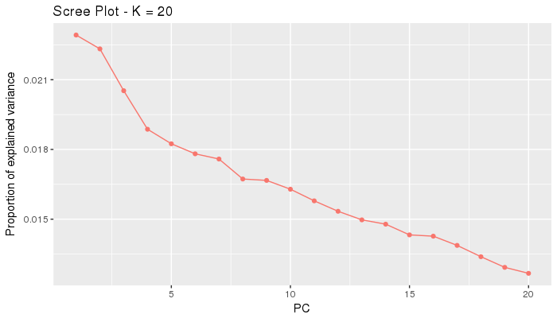
```
#Plot the actual PCA (first two PCAs)
p5 <- plot(y, option = "scores", i=1, j=2, pop=poplist.names)
```
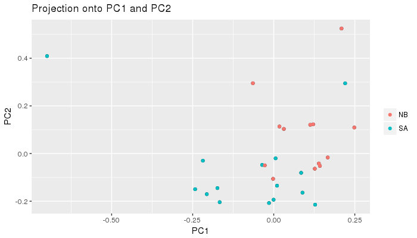
```
#Plot PCA with PCA 1 and PCA 3
p6 <- plot(y, option = "scores", i=1, j=3, pop = poplist.names)
```
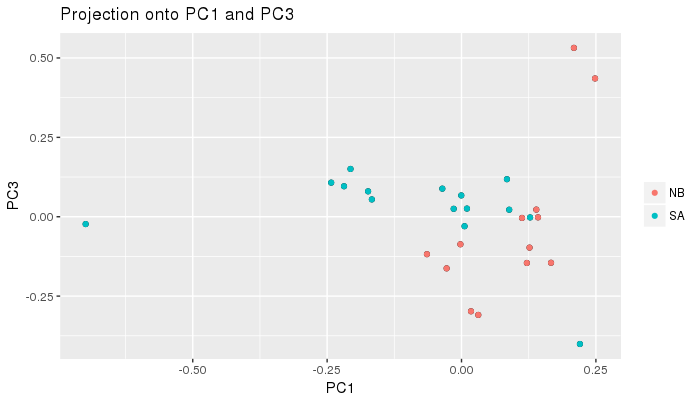
```
#Plot PCA with PCA 2 and PCA 3
p7 <- plot(y, option = "scores", i=2, j=3, pop = poplist.names)
```
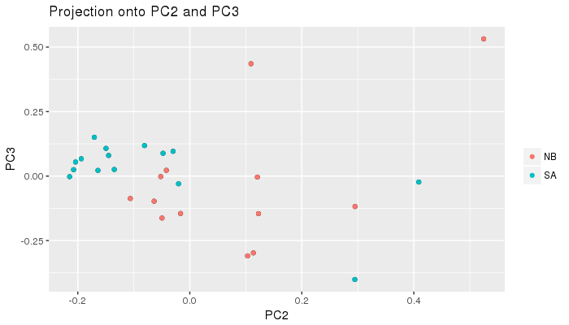
```
#Plot PCA with PCA 2 and PCA 4
p8 <- plot(y, option = "scores", i=2, j=4, pop = poplist.names)
```
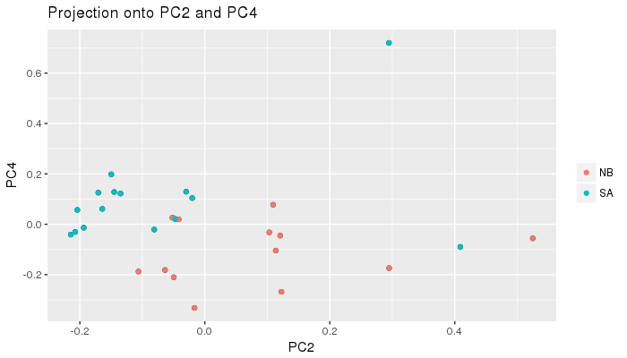
```

# post-outlier removal view
#Make Manhattan Plot
plot(y, option = "manhattan")
```
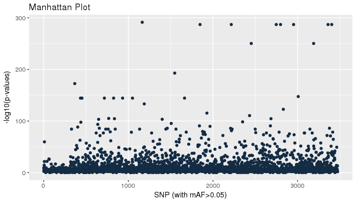
```
#Make qqplot
plot(y, option = "qqplot", threshold = 0.1)
```
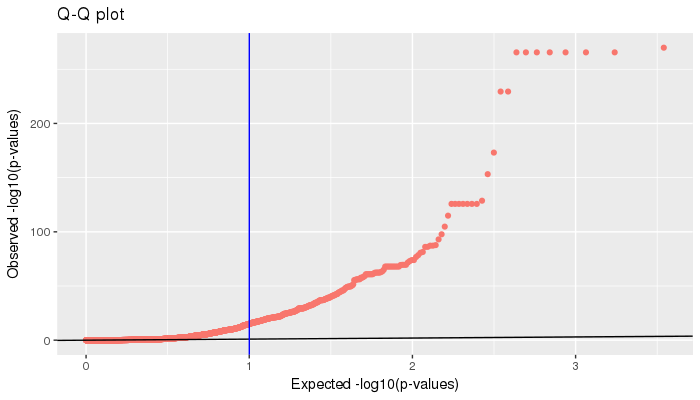
```
# Look at P-value distribution
plot(y, option = "stat.distribution")
```
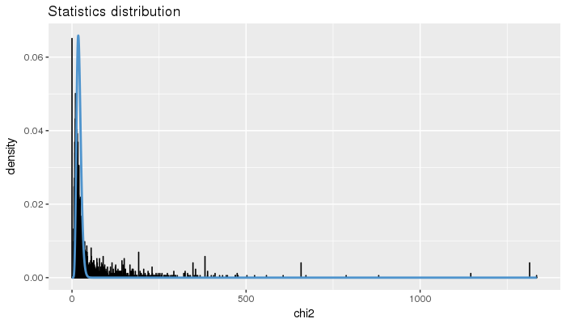
```
