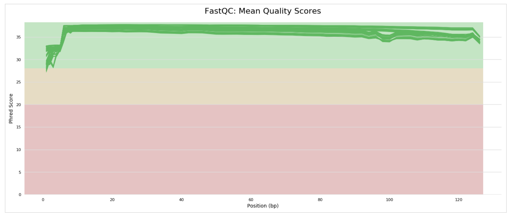

# BIO-594 FINAL PROJECT
# SNP Calling and Analysis in two populations of the marine diatom <i>Thalassiosira rotula</i>

#### Ian Bishop
#### April 28, 2018


## Preparation of workspace

These files are required for the following pipeline:

- popmap (a two column list of sampled individuals (as they are called in the VCF) and which population they belong to)
- BSsnp.spid
- plot_R.r 

Create and Activate a working environment and install the following conda packages:

```
#create environment
conda create -n final_project

# activate final_project environment
source activate final_project

# install packages
conda install fastqc multiqc bcftools

#install bamaddrg via github repository clone (https://github.com/ekg/bamaddrg)
#compile repository
#copy executable file to ~/bin

```


## RAW DATA ASSESSMENT AND TRIMMING

Combine fastq files to make one pair of R1 and R2 files per individual

```
# loop to combine multiple illumina output files into single fastq per isolate per end (R1, R2)

for name in ./*.fastq; do
	rsample=${name%_00*}
	rnum=${name##*_}
	cat "$name" >>"${rsample}.fastq"
done
```

Check initial read quality using FastQC and MultiQC

```
# run fastqc and multiqc on all fastq files for pre-trimming assessment
fastqc *.fastq

multiqc .


# export multiqc files
scp -P 2292 ibishop@kitt.uri.edu/~/final_project/raw_fastq/new_fastqc/*multiqc* .
```

Trim raw reads for adaptors and low quality using Trimmomatic
- End trimming quality threshold: 5
- Sliding window trimming quality threshold: 25

```
# make new directory for trimming
mkdir trim

# link to fastq files up one directory
ln -s ../*fastq

# loop through pairs of fastq files and trim them
for i in ./*R1.fastq.gz; do
	rsam=${i%R*}
	java -jar ./trimmomatic-0.36.jar PE -phred33 $i ${rsam}R2.fastq.gz ${i}_P_qtrim.fq.gz ${i}_UP_qtrim.fq.gz ${rsam}R2_P_qtrim.fq.gz ${rsam}R2_UP_qtrim.fq.gz ILLUMINACLIP:NexteraPE-PE.fa:2:30:10 LEADING:5 TRAILING:3 SLIDINGWINDOW:4:25 MINLEN:50
done
```

Rerun FastQC and MultiQC post-trimming to assess improvement

```
# run fastqc and multiqc on all fastq files for trimming assessment
fastqc *.fastq
multiqc .


# export multiqc files
scp -P 2292 ibishop@kitt.uri.edu/~/final_project/raw_fastq/new_fastqc/*multiqc* .
```

Pre and Post-Trimming Examples of bp quality, via MultiQC




## Mapping all (non14) paired end reads

Map reads --> sams ---> bams ---> grand_bam_list

```
#index ref
bwa index ref_euk.fa


# loop through R1 files, run bwa mem for all pairs, save to sam 
for i in `ls *R1_paired.fq`; do
	rsam=${i%R*}
	bwa mem ref_euk.fa $i ${rsam}R2_paired.fq -t 60 > ${i}.sam
done


# loop to rename sams - shorten name
for i in `ls *.sam`; do
	libr=${i%%_*}
	mv $i ${libr}.sam 
done


# convert sam to bam
for i in `ls *.sam`; do
	samtools view -o ${i}.bam -@ 60 -S ${i}
done


# loop to rename bams - shorten name
for i in `ls *.bam`; do
	libr=${i%%.sam.bam}
	mv $i ${libr}.bam 
done


# delete sam
rm *.sam


# loop and remove duplicates with samtools markdup
ls *.bam > all_bams
for i in `cat all_bams`; do

	libr=${i%%.bam};

	samtools sort -n -@ 60 -o ${libr}.namesort.bam $i;
	samtools fixmate -mr ${libr}.namesort.bam ${libr}.fixmate.namesort.bam;
	samtools sort -@ 60 -o ${libr}.positionsort.bam ${libr}.fixmate.namesort.bam;
	samtools markdup -r ${libr}.positionsort.bam ${libr}.sorted.dedup.bam;

	# remove intermediate/temp files, including original bam files
	rm ${libr}.namesort.bam ${libr}.fixmate.namesort.bam ${libr}.positionsort.bam $i

done


# remove all_bams list
rm all_bams


# make list of sorted bams
ls *sorted.dedup.bam > sorted_dedup_bams


# add read group ids
for i in `cat sorted_dedup_bams`; do
	libr=${i%%.sorted.dedup.bam};
	bamaddrg -b $i > ${libr}.sorted.dedup.rg.bam;
	rm $i
done


# make list of sorted, deduped, rg-tagged bams
ls *sorted.dedup.rg.bam > sorted_dedup_rg_bams
```


## Call SNPS, Filter SNPs

```
# create one more index for samtools for ref.euk.fa
samtools faidx ref_euk.fa


# call snps from list of bam files. grand list of bams doesn't seem to work
freebayes -f ref_euk.fa -L sorted_dedup_rg_bams > total_snps.vcf

# can't get parallel version of freebayes. fix for future use
#freebayes-parallel <(~/freebayes/scripts/fasta_generate_regions.py ref.fa.fai 100000) 36 -f ref_euk.fa -L sorted_dedup_rg_bams > var.vcf

vcftools --vcf total_snps_bigmed.vcf --remove-indels --recode --recode-INFO-all --out total_snps_med

vcftools --vcf total_snps_med.recode.vcf --max-missing 0.5 --mac 0.03 --minQ 20 --recode --recode-INFO-all --out raw.g5mac3

vcftools --vcf raw.g5mac3.recode.vcf --minDP 3 --recode --recode-INFO-all --out raw.g5mac3dp3 

curl -L -O https://github.com/jpuritz/dDocent/raw/master/scripts/filter_missing_ind.sh
chmod +x filter_missing_ind.sh
./filter_missing_ind.sh raw.g5mac3dp3.recode.vcf raw.g5mac3dplm

vcftools --vcf raw.g5mac3dplm.recode.vcf --max-missing 0.95 --maf 0.05 --recode --recode-INFO-all --out DP3g95maf05 --min-meanDP 20

vcffilter -s -f "AB > 0.20 & AB < 0.80 | AB < 0.01" DP3g95maf05.recode.vcf > DP3g95maf05.fil1.vcf

mawk '!/#/' DP3g95maf05.fil1.vcf | wc -l

vcffilter -f "QUAL / DP > 0.25" DP3g95p5maf05.fil1.vcf > DP3g95p5maf05.fil5.vcf

cut -f8 DP3g95maf05.fil5.vcf | grep -oe "DP=[0-9]*" | sed -s 's/DP=//g' > DP3g95maf05.fil5.DEPTH
mawk '!/#/' DP3g95maf05.fil5.vcf | cut -f1,2,6 > DP3g95maf05.fil5.vcf.loci.qual
mawk '{ sum += $1; n++ } END { if (n > 0) print sum / n; }' DP3g95maf05.fil5.DEPTH
python -c "print int(1952+3*(1952**0.5))"
paste DP3g95maf05.fil5.vcf.loci.qual DP3g95maf05.fil5.DEPTH | mawk -v x=2084 '$4 > x' | mawk '$3 < 2 * $4' > DP3g95maf05.fil5.lowQDloci
vcftools --vcf DP3g95maf05.fil5.vcf --site-depth --exclude-positions DP3g95maf05.fil5.lowQDloci --out DP3g95maf05.fil5
cut -f3 DP3g95maf05.fil5.ldepth > DP3g95maf05.fil5.site.depth
mawk '!/D/' DP3g95maf05.fil5.site.depth | mawk -v x=31 '{print $1/x}' > meandepthpersite

gnuplot << \EOF 
set terminal dumb size 120, 30
set autoscale
set xrange [10:150] 
unset label
set title "Histogram of mean depth per site"
set ylabel "Number of Occurrences"
set xlabel "Mean Depth"
binwidth=1
bin(x,width)=width*floor(x/width) + binwidth/2.0
set xtics 5
plot 'meandepthpersite' using (bin($1,binwidth)):(1.0) smooth freq with boxes
pause -1
EOF

vcftools --vcf  DP3g95maf05.fil5.vcf --recode-INFO-all --out DP3g95maf05.FINAL --max-meanDP 102.5 --exclude-positions DP3g95maf05.fil5.lowQDloci --recode 

```
