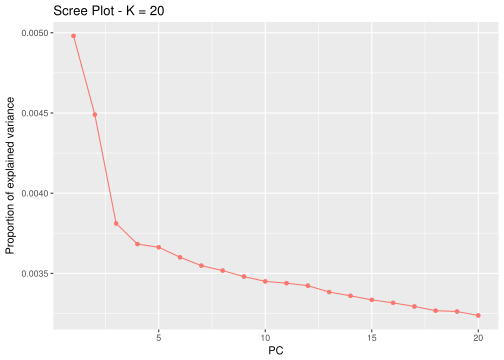
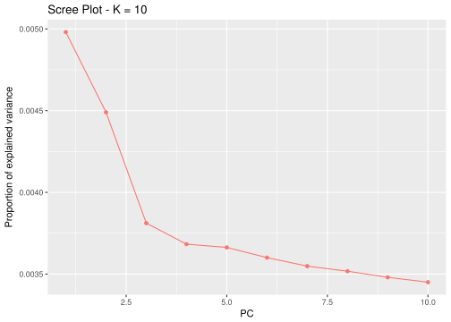
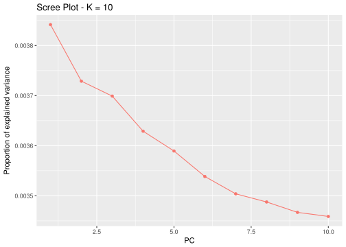
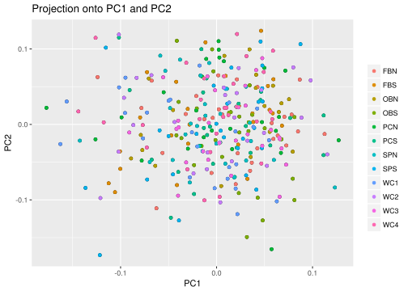
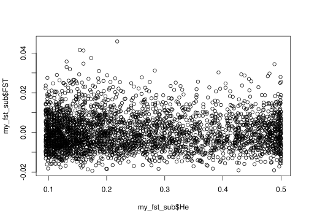
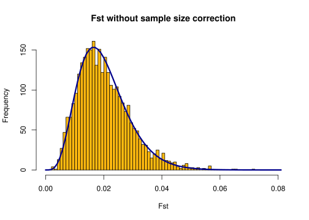
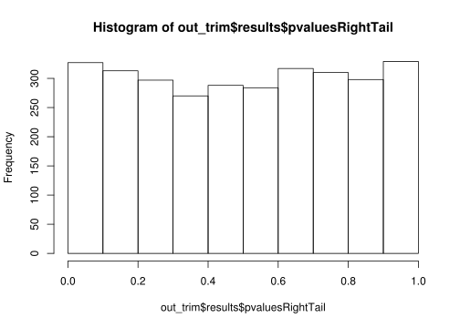

Fiddler Crab Bioinformatics and Analysis
================

This happens in the terminal
----------------------------

First let's filter loci using VCFtools

``` r
setwd("/home/jpuritz/FC_data/AS2/Filtering")
```

``` bash
vcftools --vcf TotalRawSNPs.vcf --max-missing 0.5 --maf 0.005 --minQ 20 --recode --recode-INFO-all --out TRS
```

The above line isn't run for this documentation because of time. Here is the output:

    VCFtools - 0.1.15
    (C) Adam Auton and Anthony Marcketta 2009

    Parameters as interpreted:
        --vcf TotalRawSNPs.vcf
        --recode-INFO-all
        --maf 0.005
        --minQ 20
        --max-missing 0.5
        --out TRS
        --recode

    After filtering, kept 379 out of 379 Individuals
    Outputting VCF file...
    After filtering, kept 333111 out of a possible 928985 Sites
    Run Time = 542.00 seconds

``` bash
vcftools --vcf TRS.recode.vcf --minDP 3 --recode --recode-INFO-all --out TRSdp3
```

    ## 
    ## VCFtools - 0.1.15
    ## (C) Adam Auton and Anthony Marcketta 2009
    ## 
    ## Parameters as interpreted:
    ##  --vcf TRS.recode.vcf
    ##  --recode-INFO-all
    ##  --minDP 3
    ##  --out TRSdp3
    ##  --recode
    ## 
    ## After filtering, kept 379 out of 379 Individuals
    ## Outputting VCF file...
    ## After filtering, kept 333111 out of a possible 333111 Sites
    ## Run Time = 475.00 seconds

``` bash
vcftools --vcf TRSdp3.recode.vcf --maf 0.005 --max-missing 0.5 --recode --recode-INFO-all --out TRSdp3g5
```

    ## 
    ## VCFtools - 0.1.15
    ## (C) Adam Auton and Anthony Marcketta 2009
    ## 
    ## Parameters as interpreted:
    ##  --vcf TRSdp3.recode.vcf
    ##  --recode-INFO-all
    ##  --maf 0.005
    ##  --max-missing 0.5
    ##  --out TRSdp3g5
    ##  --recode
    ## 
    ## After filtering, kept 379 out of 379 Individuals
    ## Outputting VCF file...
    ## After filtering, kept 235264 out of a possible 333111 Sites
    ## Run Time = 414.00 seconds

``` bash
./filter_missing_ind.sh TRSdp3g5.recode.vcf TRSdp3MI yes 0.5
```

    ## 
    ## VCFtools - 0.1.15
    ## (C) Adam Auton and Anthony Marcketta 2009
    ## 
    ## Parameters as interpreted:
    ##  --vcf TRSdp3g5.recode.vcf
    ##  --missing-indv
    ##  --out TRSdp3MI
    ## 
    ## After filtering, kept 379 out of 379 Individuals
    ## Outputting Individual Missingness
    ## After filtering, kept 235264 out of a possible 235264 Sites
    ## Run Time = 26.00 seconds
    ## 
    ##                                        Histogram of % missing data per individual
    ## 
    ##   40 ++---------+----**----+----------+----------+-----------+----------+----------+----------+----------+---------++
    ##      +          +    **    +          +          +           + 'totalmissing' using (bin($1,binwidth)):(1.0) ****** +
    ##      |               **                                                                                             |
    ##   35 ++            ****                                                                                            ++
    ##      |             * **                                                                                             |
    ##      |             * **                                                                                             |
    ##   30 ++            * **                                                                                            ++
    ##      |             * **                                                                                             |
    ##      |             * **                                                                                             |
    ##   25 ++            * ***                                                                                           ++
    ##      |           *** *** **                                                                                         |
    ##   20 ++          *** ******                                                                                        ++
    ##      |           *** ******                                                                                         |
    ##      |           *** ******                                                                                         |
    ##   15 ++         **** ******                                                                                        ++
    ##      |          **** ******                                                                                         |
    ##      |          **** ********                                                                                       |
    ##   10 ++         **** ***********                                                                                   ++
    ##      |         ***** ********* ****                                                      **                         |
    ##      |   ***   ***** ********* ****                                                      **                         |
    ##    5 ++  * ********* ********* ****  **                                                  **                        ++
    ##      |   * ********* ********* *********                                                 ***** **            **     |
    ##      + *** ********* ********* ************************************************************ **********************  +
    ##    0 ++***********************************************************************************************************-++
    ##      0         0.1        0.2        0.3        0.4         0.5        0.6        0.7        0.8        0.9         1
    ##                                                     % of missing data
    ## 
    ## All individuals with more than 50.0% missing data will be removed.
    ## 
    ## VCFtools - 0.1.15
    ## (C) Adam Auton and Anthony Marcketta 2009
    ## 
    ## Parameters as interpreted:
    ##  --vcf TRSdp3g5.recode.vcf
    ##  --remove lowDP.indv
    ##  --recode-INFO-all
    ##  --out TRSdp3MI
    ##  --recode
    ## 
    ## Excluding individuals in 'exclude' list
    ## After filtering, kept 341 out of 379 Individuals
    ## Outputting VCF file...
    ## After filtering, kept 235264 out of a possible 235264 Sites
    ## Run Time = 325.00 seconds

``` bash
./pop_missing_filter.sh TRSdp3MI.recode.vcf popmap 0.1 1 TRSdp3MIp9
```

    ## Filtering population FBN
    ## Filtering population FBS
    ## Filtering population OBN
    ## Filtering population OBS
    ## Filtering population PCN
    ## Filtering population PCS
    ## Filtering population SPN
    ## Filtering population SPS
    ## Filtering population WC1
    ## Filtering population WC2
    ## Filtering population WC3
    ## Filtering population WC4
    ## 
    ## VCFtools - 0.1.15
    ## (C) Adam Auton and Anthony Marcketta 2009
    ## 
    ## Parameters as interpreted:
    ##  --vcf TRSdp3MI.recode.vcf
    ##  --exclude-positions loci.to.remove
    ##  --recode-INFO-all
    ##  --out TRSdp3MIp9
    ##  --recode
    ## 
    ## After filtering, kept 341 out of 341 Individuals
    ## Outputting VCF file...
    ## After filtering, kept 77982 out of a possible 235264 Sites
    ## Run Time = 117.00 seconds

``` bash
vcftools --vcf TRSdp3MIp9.recode.vcf --recode-INFO-all --out TRSdp3MIp9g95 --max-missing 0.95 --maf 0.005 --recode
```

    ## 
    ## VCFtools - 0.1.15
    ## (C) Adam Auton and Anthony Marcketta 2009
    ## 
    ## Parameters as interpreted:
    ##  --vcf TRSdp3MIp9.recode.vcf
    ##  --recode-INFO-all
    ##  --maf 0.005
    ##  --max-missing 0.95
    ##  --out TRSdp3MIp9g95
    ##  --recode
    ## 
    ## After filtering, kept 341 out of 341 Individuals
    ## Outputting VCF file...
    ## After filtering, kept 60741 out of a possible 77982 Sites
    ## Run Time = 90.00 seconds

``` bash
./dDocent_filters TRSdp3MIp9g95.recode.vcf TRSdp3MIp9g95F yes no no
```

    ## This script will automatically filter a FreeBayes generated VCF file using criteria related to site depth,
    ## quality versus depth, strand representation, allelic balance at heterzygous individuals, and paired read representation.
    ## The script assumes that loci and individuals with low call rates (or depth) have already been removed. 
    ## 
    ## Contact Jon Puritz (jpuritz@gmail.com) for questions and see script comments for more details on particular filters 
    ## 
    ## Number of sites filtered based on allele balance at heterozygous loci, locus quality, and mapping quality / Depth
    ##  18569 of 60741 
    ## 
    ## Number of additional sites filtered based on properly paired status
    ##  2080 of 42172 
    ## 
    ## Number of sites filtered based on high depth and lower than 2*DEPTH quality score
    ##  2217 of 40092 
    ## 
    ## 
    ##                                              Histogram of mean depth per site
    ## 
    ##   350 +++-----+-----+----+-----+-----+----+-----+-----+----+-----*-----+----+-----+-----+----+-----+-----+----+----++
    ##       | +     +     +    +     +     +    +     +     +    'meandepthpersite' using (bin($1,binwidth)):(1.0) ****** +
    ##       |                                                          *  *                                               |
    ##   300 ++                                                 *       *  *                                              ++
    ##       |                                          *  *  * *     * ** *                                               |
    ##       |                                          *  *  * *     **** **                                              |
    ##       |                                   **     * *** ***  * **********                                            |
    ##   250 ++                                  ***   ** *******  * **********                                           ++
    ##       |                                   *** *************** **********                                            |
    ##       |                                  **** *************** *********** **                                        |
    ##   200 ++                          *   * ********************************* ***                                      ++
    ##       |                          ** ******************************************                                      |
    ##       |                        * ** ******************************************                                      |
    ##   150 ++               **      * ** *******************************************                                    ++
    ##       |           **   ****   **************************************************                                    |
    ##       |           ** * ****** ***************************************************  **                               |
    ##   100 ++   * *  ****** ***************************************************************                             ++
    ##       |    * *************************************************************************                              |
    ##       |  *****************************************************************************  *                           |
    ##       |  ************************************************************************************                       |
    ##    50 ++ *************************************************************************************  **                 ++
    ##       | **********************************************************************************************  ** *  *     |
    ##       |**************************************************************************************************************
    ##     0 ***************************************************************************************************************
    ##       16.15  32.3 48.45 64.6 80.75  96.9113.05129.2 145.3561.5 177.65193.8209.95226.1 242.2558.4 274.55290.7306.85 323
    ##                                                         Mean Depth
    ## 
    ## Number of sites filtered based on maximum mean depth
    ##  2117 of 40092 
    ## 
    ## Total number of sites filtered
    ##  22768 of 60741 
    ## 
    ## Remaining sites
    ##  37973 
    ## 
    ## Filtered VCF file is called Output_prefix.FIL.recode.vcf
    ## 
    ## Filter stats stored in TRSdp3MIp9g95F.filterstats

``` bash
vcfallelicprimitives -k -g TRSdp3MIp9g95F.FIL.recode.vcf |sed 's:\.|\.:\.\/\.:g' > TRSdp3MIp9g95F.prim
vcftools --vcf TRSdp3MIp9g95F.prim --remove-indels --recode --recode-INFO-all --out SNP.TRSdp3MIp9g95F
```

    ## 
    ## VCFtools - 0.1.15
    ## (C) Adam Auton and Anthony Marcketta 2009
    ## 
    ## Parameters as interpreted:
    ##  --vcf TRSdp3MIp9g95F.prim
    ##  --recode-INFO-all
    ##  --out SNP.TRSdp3MIp9g95F
    ##  --recode
    ##  --remove-indels
    ## 
    ## After filtering, kept 341 out of 341 Individuals
    ## Outputting VCF file...
    ## After filtering, kept 39633 out of a possible 41771 Sites
    ## Run Time = 53.00 seconds

For this data set, I have number of techical replicates. I will use the script `dup_sample_filter` to calculate genotypes that are not consistent across replicates.

``` bash
cat dup_sample_filter
```

    ## #!/bin/env bash
    ## 
    ## #This script will automatically remove sites in VCF files that do not have congruent genotypes across duplicate individuals
    ## #It will automatically only consider genotypes that have at least 5 reads
    ## 
    ## #
    ## 
    ## if [[ -z "$2" ]]; then
    ## echo "Usage is bash dup_sam_filter.sh VCF_file [File with duplicate sample names]"
    ## echo "The list of names should have one line per pair of duplicate samples with tab separating the two names for the same individual"
    ## exit 1
    ## fi
    ## 
    ## echo "This script assumes that duplicate samples are named in the convention of PopA_001 and PopA_001a"
    ## 
    ## NAMES=( `cut -f1  $2 `)
    ## NAM=( `cut -f2 $2 `)
    ## LEN=( `wc -l $2 `)
    ## LEN=$(($LEN - 1))
    ## 
    ## 
    ## for ((i = 0; i <= $LEN; i++));
    ## do
    ## echo "${NAMES[$i]}" > keep.${NAMES[$i]}
    ## echo "${NAM[$i]}" > keep.${NAM[$i]}
    ## 
    ## echo "Comparing" ${NAMES[$i]} "and" ${NAM[$i]} 
    ## 
    ## vcftools --vcf $1 --keep keep.${NAMES[$i]} --recode --recode-INFO-all --minDP 5 --out ${NAMES[$i]} &> /dev/null
    ## vcftools --vcf $1 --keep keep.${NAM[$i]} --recode --recode-INFO-all --minDP 5 --out ${NAM[$i]} &> /dev/null
    ## 
    ## paste <(mawk '!/#/' ${NAMES[$i]}.recode.vcf | cut -f1,2,10 | cut -f1 -d ":") <(mawk '!/#/' ${NAM[$i]}.recode.vcf | cut -f1,2,10 | cut -f1 -d ":") | mawk '$3 != $6' | mawk '!/\./' | cut -f1,2 > bad.loci.${NAMES[$i]}.${NAM[$i]}
    ## 
    ## done
    ## 
    ## 
    ## NAMES=( `cut -f1  $2 | sort | uniq `)
    ## LEN=( `cut -f1 $2 | sort | uniq | wc -l `)
    ## LEN=$(($LEN - 1))
    ## 
    ## 
    ## cat bad.loci.${NAMES[0]}.* > total.bad.loci
    ## rm ${NAMES[0]}.recode.vcf ${NAM[0]}.recode.vcf keep.${NAMES[0]} keep.${NAM[0]} &> /dev/null
    ## 
    ## for ((i = 1; i <= $LEN; i++));
    ## do
    ## cat bad.loci.${NAMES[$i]}.* >> total.bad.loci 
    ## rm ${NAMES[$i]}.recode.vcf ${NAM[$i]}.recode.vcf keep.${NAMES[$i]} keep.${NAM[$i]} &> /dev/null
    ## 
    ## done
    ## 
    ## cat total.bad.loci | perl -e 'while (<>) {chomp; $z{$_}++;} while(($k,$v) = each(%z)) {print "$v\t$k\n";}' > mismatched.loci
    ## 
    ## echo "Finished comparisons.  Results in mismatched.loci"
    ## rm total.bad.loci &> /dev/null

``` bash
cat dups
```

    ## FBN_327a FBN_327b
    ## FBN_327a FBN_327c
    ## FBN_327a FBN_327d
    ## FBN_327b FBN_327c    
    ## FBN_327c FBN_327d
    ## FBN_327b FBN_327d
    ## OBN_009a OBN_9b  
    ## OBN_009a OBN_9c
    ## OBN_009a OBN_9d
    ## OBN_9b   OBN_9c
    ## OBN_9b   OBN_9c      
    ## OBN_9c   OBN_9d
    ## OBS_245a OBS_245b
    ## OBS_245a OBS_245c    
    ## OBS_245a OBS_245d
    ## OBS_245b OBS_245c
    ## OBS_245b OBS_245d            
    ## OBS_245c OBS_245d
    ## PCN_210a PCN_210b
    ## PCN_223a PCN_223b
    ## PCS_361a PCS_361b
    ## PCS_365a PCS_365b
    ## SPS_74a  SPS_74b
    ## SPS_92a  SPS_92b
    ## SPS_92a  SPS_92c
    ## SPS_92a  SPS_92d
    ## SPS_92b  SPS_92c
    ## SPS_92b  SPS_92d
    ## SPS_92c  SPS_92d
    ## WC2_301a WC2_301b
    ## WC2_305a WC2_305b    
    ## WC2_305a WC2_305c
    ## WC2_305b WC2_305c

``` bash
./dup_sample_filter SNP.TRSdp3MIp9g95F.recode.vcf dups
```

    ## This script assumes that duplicate samples are named in the convention of PopA_001 and PopA_001a
    ## Comparing FBN_327a and FBN_327b
    ## Comparing FBN_327a and FBN_327c
    ## Comparing FBN_327a and FBN_327d
    ## Comparing FBN_327b and FBN_327c
    ## Comparing FBN_327c and FBN_327d
    ## Comparing FBN_327b and FBN_327d
    ## Comparing OBN_009a and OBN_9b
    ## Comparing OBN_009a and OBN_9c
    ## Comparing OBN_009a and OBN_9d
    ## Comparing OBN_9b and OBN_9c
    ## Comparing OBN_9b and OBN_9c
    ## Comparing OBN_9c and OBN_9d
    ## Comparing OBS_245a and OBS_245b
    ## Comparing OBS_245a and OBS_245c
    ## Comparing OBS_245a and OBS_245d
    ## Comparing OBS_245b and OBS_245c
    ## Comparing OBS_245b and OBS_245d
    ## Comparing OBS_245c and OBS_245d
    ## Comparing PCN_210a and PCN_210b
    ## Comparing PCN_223a and PCN_223b
    ## Comparing PCS_361a and PCS_361b
    ## Comparing PCS_365a and PCS_365b
    ## Comparing SPS_74a and SPS_74b
    ## Comparing SPS_92a and SPS_92b
    ## Comparing SPS_92a and SPS_92c
    ## Comparing SPS_92a and SPS_92d
    ## Comparing SPS_92b and SPS_92c
    ## Comparing SPS_92b and SPS_92d
    ## Comparing SPS_92c and SPS_92d
    ## Comparing WC2_301a and WC2_301b
    ## Comparing WC2_305a and WC2_305b
    ## Comparing WC2_305a and WC2_305c
    ## Comparing WC2_305b and WC2_305c
    ## Finished comparisons.  Results in mismatched.loci

``` bash
echo -e "Mismatches\tNumber_of_Loci" > mismatch.txt
for i in {2..20}
do 
paste <(echo $i) <(mawk -v x=$i '$1 > x' mismatched.loci | wc -l) >> mismatch.txt
done
```

``` r
library(ggplot2)
mismatch <- read.table("mismatch.txt", header = TRUE)
df=data.frame(mismatch)

p <- ggplot(df, aes(x=Mismatches, y=Number_of_Loci)) + geom_point() +theme_bw() + scale_x_continuous(minor_breaks = seq(1,20,by=1))
p
```


``` bash
mawk '$1 > 6' mismatched.loci > bad.dup.loci
vcftools --vcf SNP.TRSdp3MIp9g95F.recode.vcf --exclude-positions bad.dup.loci --recode --recode-INFO-all --out SNP.TRSdp3MIp9g95FDF
```

    ## 
    ## VCFtools - 0.1.15
    ## (C) Adam Auton and Anthony Marcketta 2009
    ## 
    ## Parameters as interpreted:
    ##  --vcf SNP.TRSdp3MIp9g95F.recode.vcf
    ##  --exclude-positions bad.dup.loci
    ##  --recode-INFO-all
    ##  --out SNP.TRSdp3MIp9g95FDF
    ##  --recode
    ## 
    ## After filtering, kept 341 out of 341 Individuals
    ## Outputting VCF file...
    ## After filtering, kept 39633 out of a possible 39633 Sites
    ## Run Time = 70.00 seconds

``` bash
rad_haplotyper.pl -p popmap -v SNP.TRSdp3MIp9g95FDF.recode.vcf -r reference.fasta -g SNPTRSdp3MIp9g95FDF -mp 5 -x 40 -z 0.1 -e
```

``` bash
mawk '/FILT/' stats.out | cut -f1 > bad.hap.dp3.loci
bash remove.bad.hap.loci.sh bad.hap.dp3.loci SNP.TRSdp3MIp9g95FDF.recode.vcf
```

    ## 
    ## VCFtools - 0.1.15
    ## (C) Adam Auton and Anthony Marcketta 2009
    ## 
    ## Parameters as interpreted:
    ##  --vcf SNP.TRSdp3MIp9g95FDF.recode.vcf
    ##  --exclude-positions temp.bad.loci
    ##  --recode-INFO-all
    ##  --out SNP.TRSdp3MIp9g95FDF.HF
    ##  --recode
    ## 
    ## After filtering, kept 341 out of 341 Individuals
    ## Outputting VCF file...
    ## After filtering, kept 32572 out of a possible 39633 Sites
    ## Run Time = 44.00 seconds

``` bash
vcftools --vcf SNP.TRSdp3MIp9g95FDF.HF.recode.vcf --missing-indv
head out.imiss
```

    ## 
    ## VCFtools - 0.1.15
    ## (C) Adam Auton and Anthony Marcketta 2009
    ## 
    ## Parameters as interpreted:
    ##  --vcf SNP.TRSdp3MIp9g95FDF.HF.recode.vcf
    ##  --missing-indv
    ## 
    ## After filtering, kept 341 out of 341 Individuals
    ## Outputting Individual Missingness
    ## After filtering, kept 32572 out of a possible 32572 Sites
    ## Run Time = 3.00 seconds
    ## INDV N_DATA  N_GENOTYPES_FILTERED    N_MISS  F_MISS
    ## FBN_306  32572   0   325 0.0099779
    ## FBN_307  32572   0   186 0.00571043
    ## FBN_308  32572   0   96  0.00294732
    ## FBN_309  32572   0   607 0.0186356
    ## FBN_310  32572   0   134 0.00411396
    ## FBN_311  32572   0   143 0.00439027
    ## FBN_312  32572   0   152 0.00466658
    ## FBN_313  32572   0   148 0.00454378
    ## FBN_314  32572   0   185 0.00567972

``` bash
mawk '/FBN_327/ || /OBN_9/ || /OBN_009/ || /OBS_245/ || /PCN_210/ || /PCN_223/ || /PCS_361/ || /PCS_365/ || /SPC_92/ || /WC2_301/ || /WC2_305/ || /SPS_74/ || /SPS_92/' out.imiss > dup.imiss
cat dup.imiss
```

    ## FBN_327a 32572   0   14  0.000429817
    ## FBN_327b 32572   0   31  0.000951738
    ## FBN_327c 32572   0   12  0.000368415
    ## FBN_327d 32572   0   24  0.000736829
    ## OBN_009a 32572   0   48  0.00147366
    ## OBN_9b   32572   0   3   9.21036e-05
    ## OBN_9c   32572   0   4   0.000122805
    ## OBN_9d   32572   0   50  0.00153506
    ## OBS_245a 32572   0   43  0.00132015
    ## OBS_245b 32572   0   17  0.000521921
    ## OBS_245c 32572   0   202 0.00620165
    ## OBS_245d 32572   0   12  0.000368415
    ## PCN_210a 32572   0   107 0.00328503
    ## PCN_210b 32572   0   85  0.0026096
    ## PCN_223a 32572   0   135 0.00414466
    ## PCN_223b 32572   0   65  0.00199558
    ## PCS_361a 32572   0   159 0.00488149
    ## PCS_361b 32572   0   94  0.00288591
    ## PCS_365a 32572   0   117 0.00359204
    ## PCS_365b 32572   0   103 0.00316223
    ## SPS_74a  32572   0   47  0.00144296
    ## SPS_74b  32572   0   81  0.0024868
    ## SPS_92a  32572   0   7   0.000214909
    ## SPS_92b  32572   0   35  0.00107454
    ## SPS_92c  32572   0   5   0.000153506
    ## SPS_92d  32572   0   71  0.00217979
    ## WC2_301a 32572   0   37  0.00113594
    ## WC2_301b 32572   0   475 0.0145831
    ## WC2_305a 32572   0   405 0.012434
    ## WC2_305b 32572   0   57  0.00174997
    ## WC2_305c 32572   0   249 0.0076446

``` bash
mawk '!/FBN_327c/ && !/OBN_9b/ && !/OBS_245d/ && !/PCN_210b/ && !/PCN_223b/ && !/PCS_361b/ && !/PCS_365b/ && !/SPS_74a/ && !/SPS_92c/ && !/WC2_301a/ && !/WC2_305b/' dup.imiss > duplicate.samples.to.remove
vcftools --vcf SNP.TRSdp3MIp9g95FDF.HF.recode.vcf --recode --recode-INFO-all --out SNP.TRSdp3MIp9g95FDFHFDF --remove duplicate.samples.to.remove
```

    ## 
    ## VCFtools - 0.1.15
    ## (C) Adam Auton and Anthony Marcketta 2009
    ## 
    ## Parameters as interpreted:
    ##  --vcf SNP.TRSdp3MIp9g95FDF.HF.recode.vcf
    ##  --remove duplicate.samples.to.remove
    ##  --recode-INFO-all
    ##  --out SNP.TRSdp3MIp9g95FDFHFDF
    ##  --recode
    ## 
    ## Excluding individuals in 'exclude' list
    ## After filtering, kept 321 out of 341 Individuals
    ## Outputting VCF file...
    ## After filtering, kept 32572 out of a possible 32572 Sites
    ## Run Time = 46.00 seconds

``` bash
filter_hwe_by_pop.pl -v SNP.TRSdp3MIp9g95FDFHFDF.recode.vcf -c 0.5 -p popmap -o SNP.TRSdp3MIp9g95FDFHFNDHWE
vcftools --vcf SNP.TRSdp3MIp9g95FDFHFNDHWE.recode.vcf --recode --recode-INFO-all --out SNP.TRSdp3MIp9g95FDFHFNDHWEmaf0252A --maf 0.025 --max-alleles 2
```

    ## Processing population: FBN (33 inds)
    ## Processing population: FBS (30 inds)
    ## Processing population: OBN (31 inds)
    ## Processing population: OBS (32 inds)
    ## Processing population: PCN (33 inds)
    ## Processing population: PCS (33 inds)
    ## Processing population: SPN (33 inds)
    ## Processing population: SPS (33 inds)
    ## Processing population: WC1 (28 inds)
    ## Processing population: WC2 (33 inds)
    ## Processing population: WC3 (29 inds)
    ## Processing population: WC4 (31 inds)
    ## Outputting results of HWE test for filtered loci to 'filtered.hwe'
    ## Kept 32377 of a possible 32572 loci (filtered 195 loci)
    ## 
    ## VCFtools - 0.1.15
    ## (C) Adam Auton and Anthony Marcketta 2009
    ## 
    ## Parameters as interpreted:
    ##  --vcf SNP.TRSdp3MIp9g95FDFHFNDHWE.recode.vcf
    ##  --recode-INFO-all
    ##  --maf 0.025
    ##  --max-alleles 2
    ##  --out SNP.TRSdp3MIp9g95FDFHFNDHWEmaf0252A
    ##  --recode
    ## 
    ## After filtering, kept 321 out of 321 Individuals
    ## Outputting VCF file...
    ## After filtering, kept 12894 out of a possible 32377 Sites
    ## Run Time = 19.00 seconds

setup
-----

``` r
library(pcadapt)
```

load our VCF file into R
------------------------

``` r
filename <- read.pcadapt("SNP.TRSdp3MIp9g95FDFHFNDHWEmaf0252A.recode.vcf", type = "vcf")
```

    ## No variant got discarded.
    ## Summary:
    ## 
    ##  - input file:               SNP.TRSdp3MIp9g95FDFHFNDHWEmaf0252A.recode.vcf
    ##  - output file:              SNP.TRSdp3MIp9g95FDFHFNDHWEmaf0252A.recode.pcadapt
    ## 
    ##  - number of individuals detected:   321
    ##  - number of loci detected:      12894

Let's plot the PCs
------------------

    ## Reading file /home/jpuritz/FC_data/AS2/Filtering/SNP.TRSdp3MIp9g95FDFHFNDHWEmaf0252A.recode.pcadapt...
    ## Number of SNPs: 12894
    ## Number of individuals: 321

 There is a pronounced jump at 3 \#\# Plot Plot the likelihoods for only first 10 K

``` r
plot(x, option = "screeplot", K = 10)
```



Calculate population designations
---------------------------------

``` bash
vcftools --vcf SNP.TRSdp3MIp9g95FDFHFNDHWEmaf0252A.recode.vcf --missing-indv
cut -f1 out.imiss |grep -v INDV| cut -f1 -d "_" | sort | uniq -c
```

    ## 
    ## VCFtools - 0.1.15
    ## (C) Adam Auton and Anthony Marcketta 2009
    ## 
    ## Parameters as interpreted:
    ##  --vcf SNP.TRSdp3MIp9g95FDFHFNDHWEmaf0252A.recode.vcf
    ##  --missing-indv
    ## 
    ## After filtering, kept 321 out of 321 Individuals
    ## Outputting Individual Missingness
    ## After filtering, kept 12894 out of a possible 12894 Sites
    ## Run Time = 1.00 seconds
    ##      30 FBN
    ##      25 FBS
    ##      19 OBN
    ##      28 OBS
    ##      27 PCN
    ##      25 PCS
    ##      29 SPN
    ##      29 SPS
    ##      25 WC1
    ##      27 WC2
    ##      28 WC3
    ##      29 WC4

Create population designations
==============================

``` r
poplist.names <- c(rep("FBN", 30),rep("FBS", 25),rep("OBN", 19), rep("OBS",28),rep("PCN",27),rep("PCS",25),rep("SPN",29), rep("SPS",29),rep("WC1",25), rep("WC2",27),rep("WC3",28),rep("WC4",29))
```

### Plot the actual PCA (first two PCAs)

``` r
plot(x, option = "scores", pop = poplist.names)
```


### Problem

Looks like there are two individuals that are not the correct species. I'm happy there are only 2! Let's figure out who they are:

``` r
which(x$scores[,2]>0.4)
```

    ## [1] 171 178

``` bash
paste <(seq 1 321) <(cut -f1 out.imiss |grep -v INDV) | mawk '$1 ~ /171/ || $1 ~ /178/'
```

    ## 171  SPN_390
    ## 178  SPN_398

From the output this appears to be sample SPN\_390 and SPN\_398. I will remove them and load a new vcf

``` bash
vcftools --vcf SNP.TRSdp3MIp9g95FDFHFNDHWEmaf0252A.recode.vcf --remove <(echo -e "SPN_390\nSPN_398") --recode --recode-INFO-all --out SNP.TRSdp3MIp9g95FDFHFNDHWEmaf0252ASF.recode.vcf
```

    ## 
    ## VCFtools - 0.1.15
    ## (C) Adam Auton and Anthony Marcketta 2009
    ## 
    ## Parameters as interpreted:
    ##  --vcf SNP.TRSdp3MIp9g95FDFHFNDHWEmaf0252A.recode.vcf
    ##  --remove /dev/fd/63
    ##  --recode-INFO-all
    ##  --out SNP.TRSdp3MIp9g95FDFHFNDHWEmaf0252ASF.recode.vcf
    ##  --recode
    ## 
    ## Excluding individuals in 'exclude' list
    ## After filtering, kept 319 out of 321 Individuals
    ## Outputting VCF file...
    ## After filtering, kept 12894 out of a possible 12894 Sites
    ## Run Time = 17.00 seconds

``` r
filename <- read.pcadapt("SNP.TRSdp3MIp9g95FDFHFNDHWEmaf0252ASF.recode.vcf", type = "vcf" )
```

    ## No variant got discarded.
    ## Summary:
    ## 
    ##  - input file:               SNP.TRSdp3MIp9g95FDFHFNDHWEmaf0252ASF.recode.vcf
    ##  - output file:              SNP.TRSdp3MIp9g95FDFHFNDHWEmaf0252ASF.recode.pcadapt
    ## 
    ##  - number of individuals detected:   319
    ##  - number of loci detected:      12922

``` r
x <- pcadapt(input = filename, K = 20)
```

    ## Reading file /home/jpuritz/FC_data/AS2/Filtering/SNP.TRSdp3MIp9g95FDFHFNDHWEmaf0252ASF.recode.pcadapt...
    ## Number of SNPs: 12922
    ## Number of individuals: 319

``` r
#Plot the likelihoods
plot(x, option = "screeplot")
```


Looks like 3 might be a good cutoff. Let's zoom in:

``` r
plot(x, option = "screeplot", K = 10)
```



I will stick with being conservative at K=3

    ## Reading file /home/jpuritz/FC_data/AS2/Filtering/SNP.TRSdp3MIp9g95FDFHFNDHWEmaf0252ASF.recode.pcadapt...
    ## Number of SNPs: 12922
    ## Number of individuals: 319

Create population designations
==============================

``` r
poplist.names <- c(rep("FBN", 30),rep("FBS", 25),rep("OBN", 19), rep("OBS",28),rep("PCN",27),rep("PCS",25),rep("SPN",27), rep("SPS",29),rep("WC1",25), rep("WC2",27),rep("WC3",28),rep("WC4",29))
```

### Plot the actual PCA (first two PCAs)

``` r
plot(x1, option = "scores", pop = poplist.names)
```



Well, not a ton of spatial structure here...

Start looking for outliers
--------------------------

Make Manhattan Plot
===================

``` r
plot(x1 , option = "manhattan")
```

 \# Make qqplot

``` r
plot(x1, option = "qqplot", threshold = 0.05)
```


Look at P-value distribution
============================

``` r
plot(x1, option = "stat.distribution")
```

 \# Set FDR

``` r
library(qvalue)
qval1 <- qvalue(x1$pvalues)$qvalues
alpha <- 0.05
```

Save outliers
=============

``` r
outliers1 <- which(qval1 < alpha)
outliers1
```

    ##   [1]   136   154   283   437   438   458   701   794  1307  1308  1616
    ##  [12]  2336  2337  2518  2519  2521  2522  2523  2527  2528  2531  2532
    ##  [23]  2533  2534  2537  2538  2543  2700  2935  3229  3391  3594  3897
    ##  [34]  3900  3904  3906  3907  3908  3909  3910  3911  4191  4303  4573
    ##  [45]  4939  4960  4966  5123  5124  5290  5291  5292  5293  5294  5607
    ##  [56]  5814  6277  6595  6597  6598  6599  6600  6605  6606  6607  6608
    ##  [67]  6609  6611  6612  6670  6976  7058  7235  7347  7348  7349  7350
    ##  [78]  7351  7352  7354  7355  7356  7357  7358  7359  7360  7362  7363
    ##  [89]  7364  7365  7576  8415  9434  9435  9530  9565  9848 10514 10580
    ## [100] 10696 10697 10698 10783 10807 10808 11117 11178 11293 11357 11448
    ## [111] 11990 11991 11992 11993 12111 12114 12115 12173 12209 12210 12302
    ## [122] 12468 12689 12879

``` r
system("rm outliers1.txt", wait=FALSE)
invisible(lapply(outliers1, write, "outliers1.txt", append=TRUE))
```

``` bash
head outliers1.txt
```

    ## 136
    ## 154
    ## 283
    ## 437
    ## 438
    ## 458
    ## 701
    ## 794
    ## 1307
    ## 1308

``` bash
mawk '!/#/' SNP.TRSdp3MIp9g95FDFHFNDHWEmaf0252ASF.recode.vcf | cut -f1,2 > totalloci
NUM=(`cat totalloci | wc -l`)
paste <(seq 1 $NUM) totalloci > loci.plus.index
cat outliers1.txt | parallel "grep -w ^{} loci.plus.index" | cut -f2,3> outlier.loci.txt
head outlier.loci.txt
```

    ## dDocent_Contig_1288  145
    ## dDocent_Contig_1397  108
    ## dDocent_Contig_2034  308
    ## dDocent_Contig_2597  80
    ## dDocent_Contig_2597  81
    ## dDocent_Contig_2640  258
    ## dDocent_Contig_3464  95
    ## dDocent_Contig_3665  263
    ## dDocent_Contig_4528  205
    ## dDocent_Contig_4528  300

Outflank
========

First, let's only work with SNPs with MAF &gt; 0.05

``` bash
vcftools --vcf SNP.TRSdp3MIp9g95FDFHFNDHWEmaf0252ASF.recode.vcf --maf 0.05 --recode --recode-INFO-all --out SNP.TRSdp3MIp9g95FDFHFNDHWEmaf0252ASFmaf05
```

    ## 
    ## VCFtools - 0.1.15
    ## (C) Adam Auton and Anthony Marcketta 2009
    ## 
    ## Parameters as interpreted:
    ##  --vcf SNP.TRSdp3MIp9g95FDFHFNDHWEmaf0252ASF.recode.vcf
    ##  --recode-INFO-all
    ##  --maf 0.05
    ##  --out SNP.TRSdp3MIp9g95FDFHFNDHWEmaf0252ASFmaf05
    ##  --recode
    ## 
    ## After filtering, kept 319 out of 319 Individuals
    ## Outputting VCF file...
    ## After filtering, kept 8368 out of a possible 12922 Sites
    ## Run Time = 12.00 seconds

``` r
library(OutFLANK)  # outflank package
library(vcfR)
```

    ## 
    ##    *****       ***   vcfR   ***       *****
    ##    This is vcfR 1.8.0 
    ##      browseVignettes('vcfR') # Documentation
    ##      citation('vcfR') # Citation
    ##    *****       *****      *****       *****

``` r
library(bigsnpr)   # package for LD pruning
```

    ## Loading required package: bigstatsr

``` r
my_vcf <- read.vcfR("SNP.TRSdp3MIp9g95FDFHFNDHWEmaf0252ASFmaf05.recode.vcf")
```

    ## Scanning file to determine attributes.
    ## File attributes:
    ##   meta lines: 64
    ##   header_line: 65
    ##   variant count: 8368
    ##   column count: 328
    ## 
    Meta line 64 read in.
    ## All meta lines processed.
    ## gt matrix initialized.
    ## Character matrix gt created.
    ##   Character matrix gt rows: 8368
    ##   Character matrix gt cols: 328
    ##   skip: 0
    ##   nrows: 8368
    ##   row_num: 0
    ## 
    Processed variant 1000
    Processed variant 2000
    Processed variant 3000
    Processed variant 4000
    Processed variant 5000
    Processed variant 6000
    Processed variant 7000
    Processed variant 8000
    Processed variant: 8368
    ## All variants processed

``` r
geno <- extract.gt(my_vcf) # Character matrix containing the genotypes
position <- getPOS(my_vcf) # Positions in bp
chromosome <- getCHROM(my_vcf) # Chromosome information

G <- matrix(NA, nrow = nrow(geno), ncol = ncol(geno))

G[geno %in% c("0/0", "0|0")] <- 0
G[geno  %in% c("0/1", "1/0", "1|0", "0|1")] <- 1
G[geno %in% c("1/1", "1|1")] <- 2

G[is.na(G)] <- 9

head(G[,1:10])
```

    ##      [,1] [,2] [,3] [,4] [,5] [,6] [,7] [,8] [,9] [,10]
    ## [1,]    0    2    0    0    0    0    0    1    0     0
    ## [2,]    1    1    0    0    1    0    0    0    0     0
    ## [3,]    0    0    0    0    0    0    1    0    0     1
    ## [4,]    0    0    0    0    0    0    0    0    0     0
    ## [5,]    0    0    0    0    0    0    2    0    2     0
    ## [6,]    0    0    0    0    0    0    0    0    0     0

``` r
pop <- as.vector(poplist.names)
```

``` r
my_fst <- MakeDiploidFSTMat(t(G), locusNames = paste0(chromosome,"_", position), popNames = pop)
```

    ## Calculating FSTs, may take a few minutes...

``` r
plot(my_fst$He, my_fst$FST)
```


``` r
plot(my_fst$FST, my_fst$FSTNoCorr)
abline(0,1)
```


We need to give OUTFlank a set of quasi-independent SNPs to estimate the neutral FST distribution. To approximate this, we will prune our SNPs to one per RAD contig

``` bash
./Filter_one_random_snp_per_contig.sh SNP.TRSdp3MIp9g95FDFHFNDHWEmaf0252ASFmaf05.recode.vcf
```

    ## Filtered VCF file is saved under name SNP.TRSdp3MIp9g95FDFHFNDHWEmaf0252ASFmaf05.filtered1SNPper.vcf

``` r
my_vcf_sub <- read.vcfR("SNP.TRSdp3MIp9g95FDFHFNDHWEmaf0252ASFmaf05.filtered1SNPper.vcf")
```

    ## Scanning file to determine attributes.
    ## File attributes:
    ##   meta lines: 64
    ##   header_line: 65
    ##   variant count: 3033
    ##   column count: 328
    ## 
    Meta line 64 read in.
    ## All meta lines processed.
    ## gt matrix initialized.
    ## Character matrix gt created.
    ##   Character matrix gt rows: 3033
    ##   Character matrix gt cols: 328
    ##   skip: 0
    ##   nrows: 3033
    ##   row_num: 0
    ## 
    Processed variant 1000
    Processed variant 2000
    Processed variant 3000
    Processed variant: 3033
    ## All variants processed

``` r
geno_sub <- extract.gt(my_vcf_sub) # Character matrix containing the genotypes
position_sub <- getPOS(my_vcf_sub) # Positions in bp
chromosome_sub <- getCHROM(my_vcf_sub) # Chromosome information

G_sub <- matrix(NA, nrow = nrow(geno_sub), ncol = ncol(geno_sub))

G_sub[geno_sub %in% c("0/0", "0|0")] <- 0
G_sub[geno_sub  %in% c("0/1", "1/0", "1|0", "0|1")] <- 1
G_sub[geno_sub %in% c("1/1", "1|1")] <- 2

G_sub[is.na(G_sub)] <- 9

head(G_sub[,1:10])
```

    ##      [,1] [,2] [,3] [,4] [,5] [,6] [,7] [,8] [,9] [,10]
    ## [1,]    0    2    0    0    0    0    0    1    0     0
    ## [2,]    1    1    0    0    1    0    0    0    0     0
    ## [3,]    0    0    0    0    0    0    1    0    0     1
    ## [4,]    0    0    0    0    0    0    0    0    0     0
    ## [5,]    2    1    0    1    2    1    0    0    2     1
    ## [6,]    2    2    2    1    1    2    2    2    2     1

``` r
pop <- as.vector(poplist.names)
```

``` r
my_fst_sub <- MakeDiploidFSTMat(t(G_sub), locusNames = paste0(chromosome_sub,"_", position_sub), popNames = pop)
```

    ## Calculating FSTs, may take a few minutes...

``` r
plot(my_fst_sub$He, my_fst_sub$FST)
```



``` r
out_trim <- OutFLANK(my_fst_sub, NumberOfSamples = 12, qthreshold=0.05, RightTrimFraction=0.05, LeftTrimFraction=0.05,Hmin =0.05)
```

``` r
OutFLANKResultsPlotter(out_trim, withOutliers = TRUE,
                       NoCorr = TRUE, Hmin =0.05, binwidth = 0.001, Zoom =
                         FALSE, RightZoomFraction = 0.05, titletext = NULL)
```



``` r
hist(out_trim$results$pvaluesRightTail)
```



``` r
P1 <- pOutlierFinderChiSqNoCorr(my_fst, Fstbar = out_trim$FSTNoCorrbar, 
                                   dfInferred = out_trim$dfInferred, qthreshold = 0.1, Hmin =0.05)
```

``` r
my_out <- P1$OutlierFlag==TRUE
plot(P1$He, P1$FST, pch=19, col=rgb(0,0,0,0.1))
points(P1$He[my_out], P1$FST[my_out], col="blue")
```


``` r
P1[which(P1$OutlierFlag == TRUE),]
```

    ##                    LocusName        He        FST          T1         T2
    ## 4162 dDocent_Contig_11504_71 0.1242568 0.06998322 0.004383171 0.06263174
    ##       FSTNoCorr    T1NoCorr   T2NoCorr meanAlleleFreq      pvalues
    ## 4162 0.09563898 0.005990199 0.06263345      0.9334416 4.297043e-07
    ##      pvaluesRightTail     qvalues OutlierFlag
    ## 4162     2.148521e-07 0.001683581        TRUE

BayeScan
========

``` bash
java -jar /usr/local/bin/PGDSpider2-cli.jar -inputfile SNP.TRSdp3MIp9g95FDFHFNDHWEmaf0252ASFmaf05.recode.vcf -outputfile SNPTRSdp3MIp9g95FDFHFNDHWEmaf0252ASFmaf05.BS -spid BSsnp.spid
```

    ## WARN  14:35:17 - PGDSpider configuration file not found! Loading default configuration.
    ## initialize convert process...
    ## read input file...
    ## read input file done.
    ## write output file...
    ## write output file done.

``` bash
BayeScan2.1_linux64bits SNPTRSdp3MIp9g95FDFHFNDHWEmaf0252ASFmaf05.BS -nbp 30 -thin 50
```

Here is the screen output

    Using 80 threads (80 cpu detected on this machine)
    Pilot runs...
    1% 2% 3% 4% 5% 6% 7% 8% 9% 10% 11% 12% 13% 14% 15% 16% 17% 18% 19% 20% 21% 22% 23% 24% 25% 26% 27% 28% 29% 30% 31% 32% 33% 34% 35% 36% 37% 38% 39% 40% 41% 42% 43% 44% 45% 46% 47% 48% 49% 50% 51% 52% 53% 54% 55% 5
    6% 57% 58% 59% 60% 61% 62% 63% 64% 65% 66% 67% 68% 69% 70% 71% 72% 73% 74% 75% 76% 77% 78% 79% 80% 81% 82% 83% 84% 85% 86% 87% 88% 89% 90% 91% 92% 93% 94% 95% 96% 97% 98% 99%
    Calculation...
    1% 2% 3% 4% 5% 6% 7% 8% 9% 10% 11% 12% 13% 14% 15% 16% 17% 18% 19% 20% 21% 22% 23% 24% 25% 26% 27% 28% 29% 30% 31% 32% 33% 34% 35% 36% 37% 38% 39% 40% 41% 42% 43% 44% 45% 46% 47% 48% 49% 50% 51% 52% 53% 54% 55% 5
    6% 57% 58% 59% 60% 61% 62% 63% 64% 65% 66% 67% 68% 69% 70% 71% 72% 73% 74% 75% 76% 77% 78% 79% 80% 81% 82% 83% 84% 85% 86% 87% 88% 89% 90% 91% 92% 93% 94% 95% 96% 97% 98% 99%

``` r
source("plot_R.r")
plot_bayescan("SNPTRSdp3MIp9g95FDFHFNDHWEmaf0252ASFmaf0_fst.txt")
```


    ## $outliers
    ## [1] 4162
    ## 
    ## $nb_outliers
    ## [1] 1

``` r
bs <- plot_bayescan("SNPTRSdp3MIp9g95FDFHFNDHWEmaf0252ASFmaf0_fst.txt", FDR = 0.1)
```


``` r
bs$outliers
```

    ## [1] 4162 5651 5652

``` bash
mawk '!/#/' SNP.TRSdp3MIp9g95FDFHFNDHWEmaf0252ASFmaf05.recode.vcf | cut -f1,2 > totalloci
NUM=(`cat totalloci | wc -l`)
paste <(seq 1 $NUM) totalloci > loci.plus.index
echo -e "4162\n5651\n5652" | parallel "grep -w ^{} loci.plus.index" | cut -f2,3> outlier2.loci.txt
head outlier2.loci.txt
```

    ## dDocent_Contig_11504 71
    ## dDocent_Contig_15049 222
    ## dDocent_Contig_15049 236

``` bash
cat outlier*.loci.txt > all.outliers
cut -f1 all.outliers | sort | uniq | wc -l
```

    ## 60
