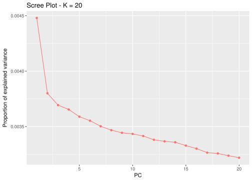
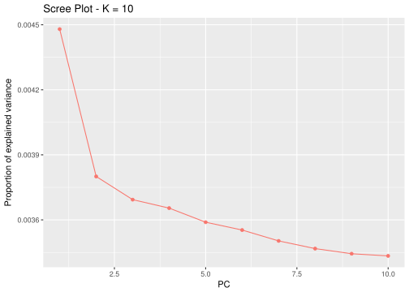
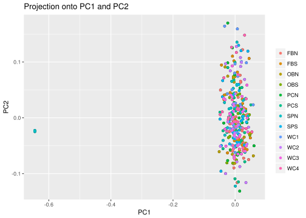
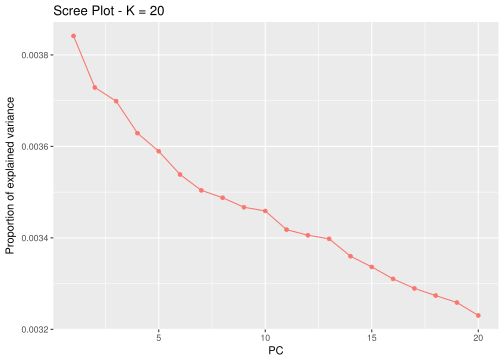
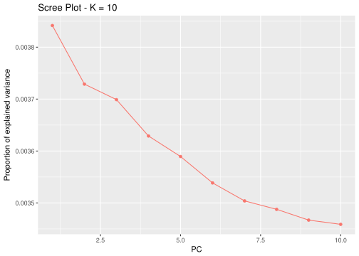
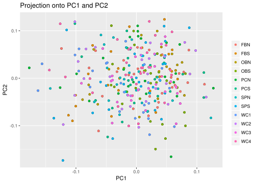
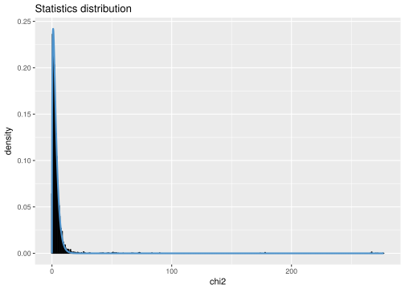
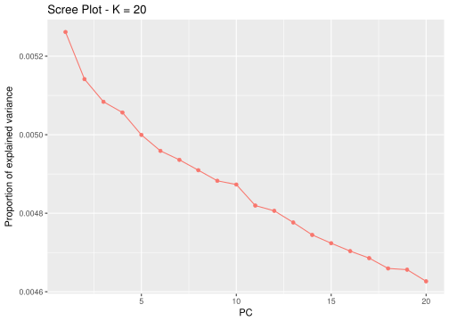
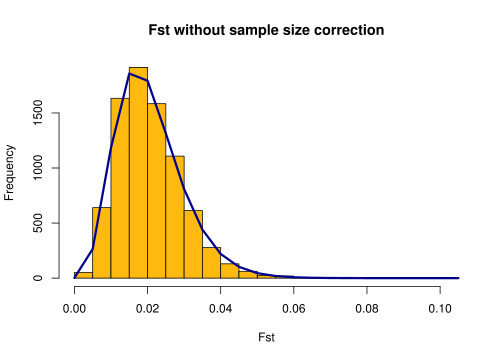
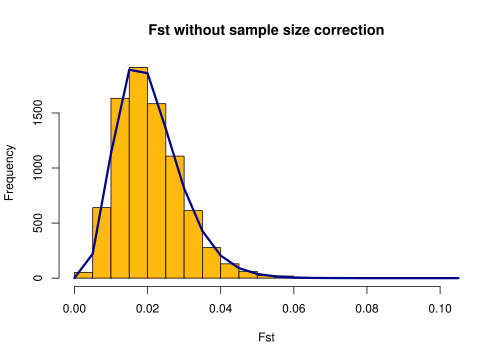

Fiddler
================

setup
-----

``` r
setwd("/home/jpuritz/FC_data/AS2/Filtering")
library(pcadapt)
```

load our VCF file into R
------------------------

``` r
filename <- read.pcadapt("SNP.TRSdp3MIp9g95FDFHFNDHWEmaf0252A.recode.vcf", type = "vcf")
```

    ## No variant got discarded.
    ## Summary:
    ## 
    ##  - input file:               SNP.TRSdp3MIp9g95FDFHFNDHWEmaf0252A.recode.vcf
    ##  - output file:              SNP.TRSdp3MIp9g95FDFHFNDHWEmaf0252A.recode.pcadapt
    ## 
    ##  - number of individuals detected:   321
    ##  - number of loci detected:      12922

Let's plot the PCs
------------------

    ## Reading file /home/jpuritz/FC_data/AS2/Filtering/SNP.TRSdp3MIp9g95FDFHFNDHWEmaf0252A.recode.pcadapt...
    ## Number of SNPs: 12922
    ## Number of individuals: 321

 There is a pronounced jump at 2 and a more subtle on at 5 \#\# Plot Plot the likelihoods for only first 10 K

``` r
plot(x, option = "screeplot", K = 10)
```



Create population designations
==============================

``` r
poplist.names <- c(rep("FBN", 30),rep("FBS", 25),rep("OBN", 19), rep("OBS",28),rep("PCN",27),rep("PCS",25),rep("SPN",29), rep("SPS",29),rep("WC1",25), rep("WC2",27),rep("WC3",28),rep("WC4",29))
```

### Plot the actual PCA (first two PCAs)

``` r
plot(x, option = "scores", pop = poplist.names)
```



### Problem

Looks like there are two individuals that are not the correct species. I'm happy there are only 2! From the output this appears to be sample SPN\_390 and SPN\_398. I will remove them and load a new vcf

Note that the `echo = FALSE` parameter was added to the code chunk to prevent printing of the R code that generated the plot.

``` r
filename <- read.pcadapt("SNP.TRSdp3MIp9g95FDFHFNDHWEmaf0252ASF.recode.vcf", type = "vcf" )
```

    ## No variant got discarded.
    ## Summary:
    ## 
    ##  - input file:               SNP.TRSdp3MIp9g95FDFHFNDHWEmaf0252ASF.recode.vcf
    ##  - output file:              SNP.TRSdp3MIp9g95FDFHFNDHWEmaf0252ASF.recode.pcadapt
    ## 
    ##  - number of individuals detected:   319
    ##  - number of loci detected:      12922

    ## Reading file /home/jpuritz/FC_data/AS2/Filtering/SNP.TRSdp3MIp9g95FDFHFNDHWEmaf0252ASF.recode.pcadapt...
    ## Number of SNPs: 12922
    ## Number of individuals: 319



Looks like 3 might be a good cutoff. Let's zoom in:

``` r
plot(x, option = "screeplot", K = 10)
```



I will stick with being conservative at K=3

    ## Reading file /home/jpuritz/FC_data/AS2/Filtering/SNP.TRSdp3MIp9g95FDFHFNDHWEmaf0252ASF.recode.pcadapt...
    ## Number of SNPs: 12922
    ## Number of individuals: 319

Create population designations
==============================

``` r
poplist.names <- c(rep("FBN", 30),rep("FBS", 25),rep("OBN", 19), rep("OBS",28),rep("PCN",27),rep("PCS",25),rep("SPN",27), rep("SPS",29),rep("WC1",25), rep("WC2",27),rep("WC3",28),rep("WC4",29))
```

### Plot the actual PCA (first two PCAs)

``` r
plot(x1, option = "scores", pop = poplist.names)
```



Well, not a ton of spatial structure here...

Start looking for outliers
--------------------------

Make Manhattan Plot
===================

``` r
plot(x1 , option = "manhattan")
```

 \# Make qqplot

``` r
plot(x1, option = "qqplot", threshold = 0.05)
```


Look at P-value distribution
============================

``` r
plot(x1, option = "stat.distribution")
```

 \# Set FDR

``` r
library(qvalue)
qval1 <- qvalue(x1$pvalues)$qvalues
alpha <- 0.05
```

Save outliers
=============

``` r
outliers1 <- which(qval1 < alpha)
outliers1
```

    ##   [1]   136   154   283   437   438   458   701   794  1307  1308  1616
    ##  [12]  2336  2337  2518  2519  2521  2522  2523  2527  2528  2531  2532
    ##  [23]  2533  2534  2537  2538  2543  2700  2935  3229  3391  3594  3897
    ##  [34]  3900  3904  3906  3907  3908  3909  3910  3911  4191  4303  4573
    ##  [45]  4939  4960  4966  5123  5124  5290  5291  5292  5293  5294  5607
    ##  [56]  5814  6277  6595  6597  6598  6599  6600  6605  6606  6607  6608
    ##  [67]  6609  6611  6612  6670  6976  7058  7235  7347  7348  7349  7350
    ##  [78]  7351  7352  7354  7355  7356  7357  7358  7359  7360  7362  7363
    ##  [89]  7364  7365  7576  8415  9434  9435  9530  9565  9848 10514 10580
    ## [100] 10696 10697 10698 10783 10807 10808 11117 11178 11293 11357 11448
    ## [111] 11990 11991 11992 11993 12111 12114 12115 12173 12209 12210 12302
    ## [122] 12468 12689 12879

Changing MAF to 0.025
---------------------

``` r
x <- pcadapt(input = filename, K = 20, min.maf = 0.025)
```

    ## Reading file /home/jpuritz/FC_data/AS2/Filtering/SNP.TRSdp3MIp9g95FDFHFNDHWEmaf0252ASF.recode.pcadapt...
    ## Number of SNPs: 12922
    ## Number of individuals: 319

``` r
plot(x, option = "screeplot")
```

 I still like K=3

``` r
x2 <- pcadapt(input = filename, K = 3, min.maf = 0.025)
```

    ## Reading file /home/jpuritz/FC_data/AS2/Filtering/SNP.TRSdp3MIp9g95FDFHFNDHWEmaf0252ASF.recode.pcadapt...
    ## Number of SNPs: 12922
    ## Number of individuals: 319

``` r
plot(x2 , option = "manhattan")
```


Make qqplot
===========

``` r
plot(x2, option = "qqplot", threshold = 0.05)
```

 \# Set FDR

``` r
library(qvalue)
qval2 <- qvalue(x2$pvalues)$qvalues
alpha <- 0.05
```

Save outliers
=============

``` r
outliers2 <- which(qval2 < alpha)
outliers2
```

    ##   [1]   136   146   154   283   379   437   438   701   791   794   795
    ##  [12]  1307  1308  1616  2061  2336  2337  2517  2518  2519  2520  2521
    ##  [23]  2522  2523  2524  2525  2526  2527  2528  2529  2531  2532  2533
    ##  [34]  2534  2536  2537  2538  2539  2540  2541  2542  2543  2662  2663
    ##  [45]  2665  2666  2700  2722  2935  3229  3262  3263  3269  3270  3272
    ##  [56]  3273  3274  3277  3278  3281  3304  3305  3306  3307  3391  3904
    ##  [67]  4191  4357  4358  4359  4361  4363  4365  4573  4939  4960  4966
    ##  [78]  5123  5124  5290  5291  5292  5293  5294  5295  5814  6389  6435
    ##  [89]  6436  6437  6438  6439  6440  6441  6442  6444  7347  7348  7349
    ## [100]  7350  7351  7352  7354  7355  7356  7357  7358  7359  7360  7362
    ## [111]  7363  7364  7365  7533  7534  7535  7536  7537  7539  7644  7647
    ## [122]  8415  8888  8908  9530  9565  9690  9848 10201 10202 10204 10207
    ## [133] 10209 10210 10211 10696 10697 10698 10783 10807 10808 10833 10838
    ## [144] 11117 11178 11448 11661 11990 11991 11992 11993 12173 12208 12595
    ## [155] 12689 12722 12798

Outflank
========

``` r
library(OutFLANK)  # outflank package
library(vcfR)
```

    ## 
    ##    *****       ***   vcfR   ***       *****
    ##    This is vcfR 1.8.0 
    ##      browseVignettes('vcfR') # Documentation
    ##      citation('vcfR') # Citation
    ##    *****       *****      *****       *****

``` r
library(bigsnpr)   # package for LD pruning
```

    ## Loading required package: bigstatsr

``` r
my_vcf <- read.vcfR("SNP.TRSdp3MIp9g95FDFHFNDHWEmaf0252ASF.recode.vcf")
```

    ## Scanning file to determine attributes.
    ## File attributes:
    ##   meta lines: 64
    ##   header_line: 65
    ##   variant count: 12922
    ##   column count: 328
    ## 
    Meta line 64 read in.
    ## All meta lines processed.
    ## gt matrix initialized.
    ## Character matrix gt created.
    ##   Character matrix gt rows: 12922
    ##   Character matrix gt cols: 328
    ##   skip: 0
    ##   nrows: 12922
    ##   row_num: 0
    ## 
    Processed variant 1000
    Processed variant 2000
    Processed variant 3000
    Processed variant 4000
    Processed variant 5000
    Processed variant 6000
    Processed variant 7000
    Processed variant 8000
    Processed variant 9000
    Processed variant 10000
    Processed variant 11000
    Processed variant 12000
    Processed variant: 12922
    ## All variants processed

``` r
geno <- extract.gt(my_vcf) # Character matrix containing the genotypes
position <- getPOS(my_vcf) # Positions in bp
chromosome <- getCHROM(my_vcf) # Chromosome information

G <- matrix(NA, nrow = nrow(geno), ncol = ncol(geno))

G[geno %in% c("0/0", "0|0")] <- 0
G[geno  %in% c("0/1", "1/0", "1|0", "0|1")] <- 1
G[geno %in% c("1/1", "1|1")] <- 2

G[is.na(G)] <- 9

head(G[,1:10])
```

    ##      [,1] [,2] [,3] [,4] [,5] [,6] [,7] [,8] [,9] [,10]
    ## [1,]    0    0    0    0    0    0    0    0    0     0
    ## [2,]    0    0    0    0    0    0    0    0    0     0
    ## [3,]    0    2    0    0    0    0    0    1    0     0
    ## [4,]    0    0    1    0    0    0    0    0    0     0
    ## [5,]    0    0    0    0    0    1    1    0    0     0
    ## [6,]    1    1    0    0    1    0    0    0    0     0

``` r
pop <- as.vector(poplist.names)
```

``` r
my_fst <- MakeDiploidFSTMat(t(G), locusNames = paste0(chromosome,"_", position), popNames = pop)
```

    ## Calculating FSTs, may take a few minutes...
    ## [1] "10000 done of 12922"

``` r
my_dist <- OutFLANK(my_fst, NumberOfSamples = 12, qthreshold=0.1, RightTrimFraction=0.1, LeftTrimFraction=0.1)
```

``` r
OutFLANKResultsPlotter(my_dist, withOutliers=TRUE)
```



``` r
plot(my_dist$results$FST, col=as.numeric(as.factor(chromosome)))
```


``` r
my_dist$results[which(my_dist$results$OutlierFlag == TRUE),]
```

    ##                    LocusName        He        FST          T1         T2
    ## 6357 dDocent_Contig_11504_71 0.1242568 0.06998322 0.004383171 0.06263174
    ##       FSTNoCorr    T1NoCorr   T2NoCorr meanAlleleFreq indexOrder GoodH
    ## 6357 0.09563898 0.005990199 0.06263345      0.9334416       6357 goodH
    ##          qvalues      pvalues pvaluesRightTail OutlierFlag
    ## 6357 0.005819914 1.502883e-06     7.514415e-07        TRUE

``` bash
vcftools --vcf SNP.TRSdp3MIp9g95FDFHFNDHWEmaf0252ASF.recode.vcf --maf 0.05 --recode --recode-INFO-all --out SNP.TRSdp3MIp9g95FDFHFNDHWEmaf0252ASFmaf05
```

    ## 
    ## VCFtools - 0.1.15
    ## (C) Adam Auton and Anthony Marcketta 2009
    ## 
    ## Parameters as interpreted:
    ##  --vcf SNP.TRSdp3MIp9g95FDFHFNDHWEmaf0252ASF.recode.vcf
    ##  --recode-INFO-all
    ##  --maf 0.05
    ##  --out SNP.TRSdp3MIp9g95FDFHFNDHWEmaf0252ASFmaf05
    ##  --recode
    ## 
    ## After filtering, kept 319 out of 319 Individuals
    ## Outputting VCF file...
    ## After filtering, kept 8368 out of a possible 12922 Sites
    ## Run Time = 12.00 seconds

``` r
my_vcf <- read.vcfR("SNP.TRSdp3MIp9g95FDFHFNDHWEmaf0252ASFmaf05.recode.vcf")
```

    ## Scanning file to determine attributes.
    ## File attributes:
    ##   meta lines: 64
    ##   header_line: 65
    ##   variant count: 8368
    ##   column count: 328
    ## 
    Meta line 64 read in.
    ## All meta lines processed.
    ## gt matrix initialized.
    ## Character matrix gt created.
    ##   Character matrix gt rows: 8368
    ##   Character matrix gt cols: 328
    ##   skip: 0
    ##   nrows: 8368
    ##   row_num: 0
    ## 
    Processed variant 1000
    Processed variant 2000
    Processed variant 3000
    Processed variant 4000
    Processed variant 5000
    Processed variant 6000
    Processed variant 7000
    Processed variant 8000
    Processed variant: 8368
    ## All variants processed

``` r
geno <- extract.gt(my_vcf) # Character matrix containing the genotypes
position <- getPOS(my_vcf) # Positions in bp
chromosome <- getCHROM(my_vcf) # Chromosome information

G <- matrix(NA, nrow = nrow(geno), ncol = ncol(geno))

G[geno %in% c("0/0", "0|0")] <- 0
G[geno  %in% c("0/1", "1/0", "1|0", "0|1")] <- 1
G[geno %in% c("1/1", "1|1")] <- 2

G[is.na(G)] <- 9

head(G[,1:10])
```

    ##      [,1] [,2] [,3] [,4] [,5] [,6] [,7] [,8] [,9] [,10]
    ## [1,]    0    2    0    0    0    0    0    1    0     0
    ## [2,]    1    1    0    0    1    0    0    0    0     0
    ## [3,]    0    0    0    0    0    0    1    0    0     1
    ## [4,]    0    0    0    0    0    0    0    0    0     0
    ## [5,]    0    0    0    0    0    0    2    0    2     0
    ## [6,]    0    0    0    0    0    0    0    0    0     0

``` r
pop <- as.vector(poplist.names)
```

``` r
my_fst <- MakeDiploidFSTMat(t(G), locusNames = paste0(chromosome,"_", position), popNames = pop)
```

    ## Calculating FSTs, may take a few minutes...

``` r
my_dist <- OutFLANK(my_fst, NumberOfSamples = 12, qthreshold=0.1, RightTrimFraction=0.05, LeftTrimFraction=0.05)
```

``` r
OutFLANKResultsPlotter(my_dist, withOutliers=TRUE)
```



``` r
plot(my_dist$results$FST, col=as.numeric(as.factor(chromosome)))
```


``` r
my_dist$results[which(my_dist$results$OutlierFlag == TRUE),]
```

    ##                    LocusName        He        FST          T1         T2
    ## 4162 dDocent_Contig_11504_71 0.1242568 0.06998322 0.004383171 0.06263174
    ##       FSTNoCorr    T1NoCorr   T2NoCorr meanAlleleFreq indexOrder GoodH
    ## 4162 0.09563898 0.005990199 0.06263345      0.9334416       4162 goodH
    ##          qvalues      pvalues pvaluesRightTail OutlierFlag
    ## 4162 0.002473617 6.143624e-07     3.071812e-07        TRUE

BayeScan
========

``` r
source("plot_R.r")
plot_bayescan("SNPTRSdp3MIp9g95FDFHFNDHWEmaf0252AS_fst.txt")
```


    ## $outliers
    ## [1] 6357 8354 8635
    ## 
    ## $nb_outliers
    ## [1] 3

``` r
source("plot_R.r")
plot_bayescan("SNPTRSdp3MIp9g95FDFHFNDHWEmaf0252AS_fst.txt", FDR=0.1)
```


    ## $outliers
    ## [1] 6357 8354 8634 8635
    ## 
    ## $nb_outliers
    ## [1] 4

``` bash
java -jar /usr/local/bin/PGDSpider2-cli.jar -inputfile SNP.TRSdp3MIp9g95FDFHFNDHWEmaf0252ASFmaf05.recode.vcf -outputfile SNPTRSdp3MIp9g95FDFHFNDHWEmaf05 -spid BSsnp.spid
```

``` bash
BayeScan2.1_linux64bits SNPTRSdp3MIp9g95FDFHFNDHWEmaf05 -nbp 30 -thin 50
```

``` r
plot_bayescan("SNPTRSdp3MIp9g95FDFHFNDHWEmaf05_fst.txt")
```


    ## $outliers
    ## [1] 4162
    ## 
    ## $nb_outliers
    ## [1] 1

``` r
plot_bayescan("SNPTRSdp3MIp9g95FDFHFNDHWEmaf05_fst.txt", FDR = 0.1)
```


    ## $outliers
    ## [1] 4162 5651 5652
    ## 
    ## $nb_outliers
    ## [1] 3
